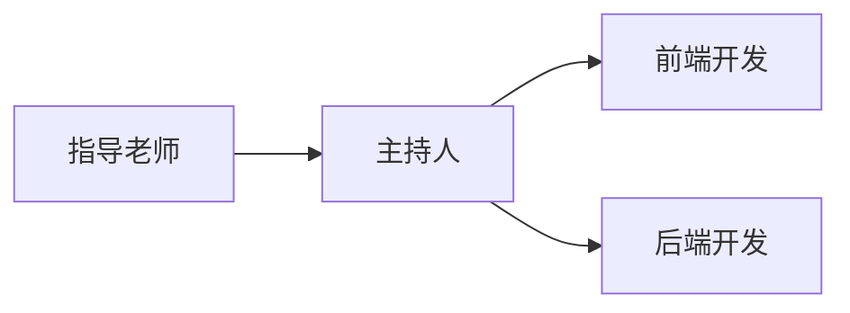

## 8. 项目组织结构

### 8.1 项目组织结构图

### 8.2 团队成员列表

| 职位     | 姓名   | 电话        | 邮箱                      |
| -------- | ------ | ----------- | ------------------------- |
| 指导教师 | 郑炜   | 13991976695 | wzheng@nwpu.edu.cn        |
| 主持人   | 陈宣辰 | 15068689791 | 1546327522@qq.com         |
| 前端开发 | 朱勇   | 15198589460 | 2802995994@qq.com         |
| 前端开发 | 王旻安 | 13777864458 | wangminan0811@hotmail.com |
| 后端开发 | 朱嘉奕 | 13773707405 | jiayizhu@mail.nwpu.edu.cn |
| 后端开发 | 耿雪龙 | 13937825104 | 3349495429@qq.com         |

### 8.3 团队成员职责

- 指导教师：负责对项目的进度进行监督，同时对技术团队的工作进行指导和管理。
- 主持人：负责产品的需求分析和产品规划，协调技术团队的工作，同时负责项目的财务管理和预算控制，协调财务团队的工作。
- 前端开发：负责前端开发和设计工作，以及前端页面设计和视觉效果的制作。
- 后端开发：负责设计、实现和维护项目的服务器端应用程序，以确保项目在服务器端的正常运行。

### 8.4 项目团队交流方式

- 会议：每周召开项目例会，对项目的进展情况进行汇报和协调。
- QQ：项目团队成员之间的日常沟通主要通过QQ进行。
- 视频通讯：使用腾讯会议等即时通讯工具，以便更加高效地进行沟通和协作。

## 9. 项目资源

### 9.1 人力资源

| 人员类型 | 人员数量 | 职责                                                         |
| -------- | -------- | :----------------------------------------------------------- |
| 指导教师 | 1        | 负责对项目的进度进行监督，同时对技术团队的工作进行指导和管理。 |
| 主持人   | 1        | 负责产品的需求分析和产品规划，协调技术团队的工作，同时负责项目的财务管理和预算控制，协调财务团队的工作。 |
| 前端开发 | 2        | 负责前端开发和设计工作，以及前端页面设计和视觉效果的制作。   |
| 后端开发 | 2        | 负责设计、实现和维护项目的服务器端应用程序，以确保项目在服务器端的正常运行。 |

### 9.2 软件

#### 9.2.1 开发工具

- 编辑器：Visual Studio Code、IDEA
- 开发框架：Vite、Element-plus、Vue、Node.js、Spring Boot
- 版本控制：Git

#### 9.2.2 开发环境

- 操作系统：Windows 10
- 虚拟机：VMware Workstation
- 数据库：MySQL
- 服务器：Apache Tomcat

#### 9.2.3 测试工具

- 单元测试：Jest、Mocha、Chai
- 集成测试：Selenium、Cypress、TestCafe
- 性能测试：JMeter、Gatling

#### 9.2.4 设计工具

- 图形设计：Adobe Photoshop、Adobe Illustrator
- 原型设计：Sketch、Adobe XD、Figma
- UML建模：Draw.io

#### 9.2.5 文档工具

- 办公套件：Microsoft Office
- 协同工具：Typora

### 9.3 硬件

#### 9.3.1 服务器

- 型号：ECS云服务器
- 处理器：Intel Xeon Gold 6240R 3.4GHz，24核心
- 内存：256GB DDR4 2933MHz ECC RDIMM
- 存储：8 x 960GB SSD
- 网络：4 x 1GbE，2 x 10GbE

#### 9.3.2 工作站

- 自用笔记本电脑

## 10. 培训计划和要求

### 10.1 培训计划

#### 10.1.1 培训内容

- 前端技术栈：HTML、CSS、JavaScript、Vue、Vite、Webpack、Element-plus
- 后端技术栈：Java、Spring Boot、MyBatis-plus、MySQL、Redis、RabbitMQ
- DevOps工具链：Docker

#### 10.1.2 培训形式

- 线上自学：通过各视频网站如B站、中国大学MOOC等网站寻找相关视频自学

#### 10.1.3 培训时间

- 线上自学：从项目立项到项目开发前共12个月左右

#### 10.1.4 培训费用

- 自费

### 10.2 培训要求

#### 10.2.1 参与人员

- 前端开发工程师：2名
- 后端开发工程师：2名

#### 10.2.2 参与条件

- 熟练掌握至少一门编程语言和相应的开发工具
- 具备一定的前端、后端或DevOps开发经验
- 能够按照要求完成相关的在线作业和实验课

## 11. 项目估算

### 11.1 规格估算

- 前端页面数量：15个
- 后端接口数量：50个
- 用户数量：1000个
- 平均在线用户数：100人
- 预计数据存储量：100GB

### 11.2 工作量估算

#### 11.2.1 前端开发工作量

- 页面设计：6个小时
- 页面编码：70个小时
- 测试和修复：16个小时

#### 11.2.2 后端开发工作量

- 接口设计：6个小时
- 接口编码：100个小时
- 测试和修复：18个小时

#### 11.2.3 数据库开发工作量

- 数据库设计：8个小时
- 数据库开发：30个小时
- 数据库测试和修复：6个小时

#### 11.2.4 DevOps工作量

- Docker镜像构建和部署：10个小时

#### 11.2.5 总工作量和时间

- 总工作量：270小时
- 开发周期：8周（2个月）
- 平均每周工作量：34小时

### 11.3 成本估算

#### 11.3.1 人力成本

- 主持人：200元
- 前端开发人员：一人250元，共500元
- 后端开发人员：一人250元，共500元

#### 11.3.2 硬件设备成本

- 服务器租用费用：500元

#### 11.3.3 软件工具成本

- 开发工具费用：300元
- 测试工具费用：0元

#### 11.3.4 总成本

- 总成本：2000元