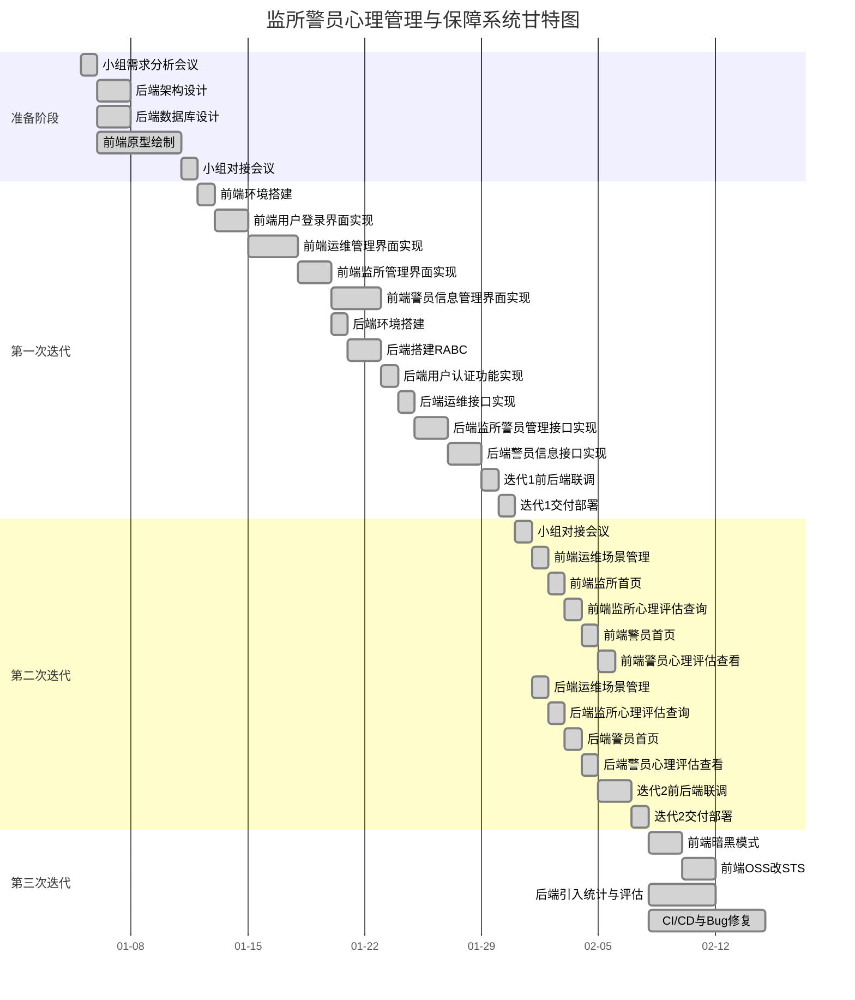
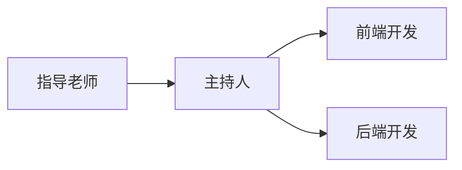

    <h1>
        监所警员心理保障与管理系统_软件开发计划_V1.0
    </h1>
    <h3>
        编写人员:王旻安,党艳,吴思赣    编写时间:2023.3.25
    </h3>

**文档评审记录**

| 日期      | 文档版本 | 评审说明                       | 评审人 |
| --------- | -------- | ------------------------------ | ------ |
| 2023.4.11 | 1.0      | 修正了编号不统一对的情况，通过 | 王旻安 |
|           |          |                                |        |
|           |          |                                |        |
|           |          |                                |        |
|           |          |                                |        |
|           |          |                                |        |
|           |          |                                |        |
|           |          |                                |        |
|           |          |                                |        |
|           |          |                                |        |

## 1. 交付产品

### 1.1 程序、文档与服务

#### 1.1.1 程序

将交付的程序分为前端与后端两个部分

**直接使用**

+ 前端

  部署网址为

  + [主站](http://management_client.wangminan.me/#/login)
  + [镜像站](http://management_backup.wangminan.me)

+ 后端

  使用docker部署，请求地址为http://123.249.5.227:8079/api

**部署**

分前后端提供部署

+ 前端提供dist文件夹，可部署在nginx上，或使用pm2+express托管
+ 后端提供jar包，名称为 ManagementServer-0.0.1-SNAPSHOT.jar，可使用java运行部署

#### 1.1.2 文档

交付的外部文档

+ 监所警员心理保障与管理系统使用说明书
+ 监所警员心理保障与管理系统部署说明书

#### 1.1.3 服务

提供监所警员心理保障与管理系统的使用培训服务。

### 1.2 非移交产品

所有内部文档，包括项目管理文档与项目技术文档

### 1.3 验收标准与交付期限

#### 1.3.1 验收标准

**总体目标**

+ 本项目能够收集并分析监警心理健康状态，将各调查数据结合相应的心理学理论，对监警的心理状况和监狱的环境进行评估。
+ 本项目能适时依据结果分析对监警进行非接触式帮助或人工帮助，降低监警心理问题出现概率，帮助监狱更制度化科学化。

**解决的关键问题**

1. 本项目能在监所警察出现心理问题时，根据模型建立明确的诱导指标；基于特定的诱导方式，对监所警察不同程度的心理问题进行适度的干预。
2. 本项目能建立分类心理诱导情景化模型，对待不同原因的心理压力时，采用不同的方式进行疏导。 
3. 本项目能创建并利用面向心理诱导的情景化内容，从而对监所警察进行心理诱导。 
4. 本项目能通过情景化的设计与构建使监所警察与情景化的内容产生沉浸式的互动，而给予其身临其境的体验。

#### 1.3.2 交付期限

在2022年75月前完成立项答辩

在2023年2月前完成编码与实现

在2023年4月完成结题答辩

## 2. 开发活动计划

### 2.1 软件开发过程与开发方法

使用了敏捷开发流程作为开发基本模型

#### 2.1.1 软件开发过程

基于敏捷开发，软件开发过程分为一下几个阶段

+ 需求分析：主要持续时间为2022.4-2022.7。在这个阶段，团队与项目负责老师以及监所讨论需求，收集用户反馈，定义产品特性，并制定一个产品需求清单。

+ 规划和设计：主要持续时间为2022.7-2022.12。在这个阶段，团队会对产品需求清单进行排序和估算，以确定可以在每个迭代期间实现的功能。然后，团队会开始设计产品架构和用户界面。

+ 开发和测试：主要持续时间为2022.12-2023.3。在这个阶段，团队会进行短周期的迭代开发和测试，每个迭代期间通常为1到4周。团队在这个阶段中会交付一个可用于生产环境的软件版本。
  + 第一次迭代：完成RABC的基础框架，完成用户登录功能与运维、监所、警员端的基本页面实现
  + 第二次迭代：完成场景模拟与心理评估的有关功能
  + 第三次迭代：完成运维、监所端的看板，接口排查与修正

+ 发布和维护：在这个阶段，团队会发布软件版本并收集用户反馈。随着时间的推移，团队将继续改进和维护软件。

#### 2.1.2 开发方法

在敏捷开发中，常用的开发方法包括测试驱动开发（TDD）、行为驱动开发（BDD）、持续集成（CI）、持续交付（CD）等等。其中，TDD和BDD注重测试用例的编写，CI和CD则关注持续集成和交付。这些开发方法的目标是加快开发周期、提高软件质量、降低开发成本。

我们使用到的开发方法为CI/CD。

+ 借助GitHub Actions编写执行脚本。
+ 后端借助docker镜像进行更新迭代部署，前端使用GitHub Pages和pm2的watch功能实现热更新。

### 2.2 软件产品标准

本次项目开发遵循ISO 9000标准

> ISO 9000是一组与质量管理相关的国际标准，由国际标准化组织（ISO）发布。它包括一系列指导性文件和标准，旨在帮助组织建立和实施有效的质量管理体系，并持续改进其业务流程和产品/服务质量。
>
> ISO 9000标准体系包括以下主要标准：
>
> 1. ISO 9001：2015 - 质量管理体系要求 ISO 9001是ISO 9000系列标准中最知名的标准，它规定了组织应如何建立、实施和维护其质量管理体系，以确保其产品和服务符合客户和法律要求。ISO 9001的要求涉及质量管理的方方面面，包括组织结构、人员培训、过程管理、产品设计和开发、供应链管理、内部审核等等。
> 2. ISO 9000：2015 - 质量管理系统基础和术语 ISO 9000是一个指导性文件，旨在帮助组织了解质量管理的基础和术语，以便更好地理解ISO 9001和其他相关标准。
> 3. ISO 9004：2018 - 质量管理 - 质量管理的持续改进 ISO 9004提供了有关如何实现持续改进的指导，以帮助组织更好地管理其业务流程和产品/服务质量。
>
> 除了上述标准外，ISO 9000系列还包括一些其他的指导性文件和技术报告，如ISO 9000-3：2002“软件工程 - 使用ISO 9001进行过程评估”，它提供了如何将ISO 9001应用于软件开发的指导。

### 2.3 处理关键性需求的方法

+ 确定关键性需求

  首先，需要明确哪些需求是关键性需求。这些需求可能是对系统功能、性能、安全性、可靠性等方面的要求，需要被特别关注和满足。在这一阶段，可以通过与客户、用户、利益相关者等沟通来识别和确认关键性需求。

+ 制定关键性需求处理策略

  接下来，需要制定一系列策略和措施来满足关键性需求。这些策略和措施可能包括：

  - 确保团队对关键性需求的理解和认识一致；

  - 制定详细的需求规格说明和测试用例，以确保关键性需求得到满足；

  - 进行设计评审、代码评审、测试评审等活动，以确保关键性需求得到充分考虑和验证；

  - 使用敏捷开发方法或迭代式开发方法，以便能够及时发现和解决关键性需求方面的问题；

  - 设定优先级和风险级别，以确保关键性需求得到适当的重视和管理。

+ 确定关键性需求的测试方法

  关键性需求的测试是非常重要的。在这一阶段，需要制定一些测试方法来验证关键性需求是否得到了满足。这些测试方法可能包括单元测试、集成测试、系统测试、性能测试、安全测试等。需要确保测试方法可以充分覆盖关键性需求，并在测试活动中及时发现和解决问题。

+ 管理关键性需求的变更

  关键性需求的变更可能会影响整个软件开发项目，因此需要制定一些变更管理策略来管理关键性需求的变更。这些策略可能包括：

  - 确定变更的来源和原因；

  - 评估变更对项目的影响；

  - 更新需求规格说明和测试用例；

  - 进行重新评审和重新测试；

  - 确保变更得到适当的记录和通知。

### 2.4 详细开发计划

详见[任务分解部分](#7. 进度表与活动图)

## 3. 配置管理计划

### 3.1配置库结构

<table>
	<tr>
	    <th>序号</th>
	    <th>内容</th>
	    <th colspan="2">说明</th>  
	</tr>
	<tr>
	    <td>1</td>
	    <td>RM</td>
	    <td colspan="2">需求管理</td>
	</tr>
	<tr>
	    <td>2</td>
	    <td>SPP</td>
	    <td colspan="2">软件项目规划</td>
	</tr>
	<tr>
	    <td>3</td>
	    <td>SPTO</td>
	    <td colspan="2">软件项目跟踪与管理</td>
	</tr>
	<tr>
	    <td>4</td>
	    <td>SCM</td>
	    <td colspan="2">软件配置管理</td>
	</tr>
	<tr>
	    <td>5</td>
	    <td>SQA</td>
	    <td colspan="2">软件质量保证</td>
	</tr>
	<tr>
	    <td rowspan="5">6</td>
	    <td rowspan="5">SPE</td>
	    <td rowspan="5">软件产品工程</td>
	</tr>
	<tr>
		<td>设计</td>
    </tr>
    <tr>
		<td>源代码</td>
    </tr>
    <tr>
		<td>测试</td>
    </tr>
    <tr>
		<td>发布</td>
    </tr>
</table>

 

### 3.2 配置标识方法

本项目配置项命名规范由3个字段组成，从左到右依次为：项目、类型、版本号，这些字段用一横线（-）进行分隔。

| 类型 | 主要配置项                 | 标识符             | 预计正式发表时间 |
| ---- | -------------------------- | ------------------ | ---------------- |
| 计划 | 《软件开发计划》           | PSAMSFPO-SDP-V1.0  | 2023年4月15日    |
| 需求 | 《软件需求规格说明》       | PSAMSFPO-SRS-V1.0  | 2023年4月15日    |
| 设计 | 《软件（结构）设计说明》   | PSAMSFPO-SSDD-V1.0 | 2023年4月15日    |
| 设计 | 《数据库（顶层）设计说明》 | PSAMSFPO-DDD-V1.0  | 2023年4月15日    |
| 编程 | 源代码                     | PSAMSFPO-SC-V1.0   | 2023年4月15日    |
| 编程 | 编码规则                   | PSAMSFPO-ER-V1.0   | 2023年4月15日    |
| 测试 | 《软件测试计划》           | PSAMSFPO-STP-V1.0  | 2023年4月15日    |
| 测试 | 《软件测试报告》           | PSAMSFPO-STR-V1.0  | 2023年4月15日    |
| 提交 | 软件产品                   | PSAMSFPO-SP-V1.0   | 2023年4月15日    |
| 提交 | 项目评审记录               | PSAMSFPO-SRR-V1.0  | 2023年4月15日    |
| 提交 | 《软件用户手册》           | PSAMSFPO-SUM-V1.0  | 2023年4月15日    |

 

### 3.3 产品构建与发布手段

项目经理编写《产品发布说明》（一份产品发布说明只能对应一个产品版本）。产品发布说明的内容应该包括：产品发布时间、产品版本说明、产品概要介绍、本次发布包含的安装包和文档说明、本次发布包含或者新增的功能特性说明、遗留问题及影响说明、版权声明以及其他需要说明的事项。

项目经理发送产品发布邮件，通知开发、测试等相关部门并附上产品发布说明和产品介绍，或者以产品发布会议的形式进行产品发布。

## 4. 质量保证计划

### 4.1 质量保证方案

由质量监督小组进行管理，每次形成的模块需要经过测试后，交于质量监督小组进行评审后，方能进行下一步工作。

### 4.2文档质量

由开发团队内部分工进行编写，等编写完成，让整个小组进行文档评审后，方能进行下一步工作。

### 4.3代码质量

开发人员编写的代码最基本要具备可用性和可维护性，可用性强调代码的正确性、可维护性强调代码易被看懂易及时修改。

## 5. 风险管理计划

项目的各个部分的负责人要承担相应的风险，包括延期风险、出错风险、管理风险等。

## 6. 文档编制计划

| 需交付的项目文档                   | 交付时间      |
| ---------------------------------- | ------------- |
| 《可行性分析报告》                 | 2023年4月15日 |
| 《可行性分析报告》评审记录         | 2023年4月15日 |
| 《软件开发计划》                   | 2023年4月15日 |
| 《软件开发计划》评审记录           | 2023年4月15日 |
| 《软件测试计划》                   | 2023年4月15日 |
| 《软件测试计划》评审记录           | 2023年4月15日 |
| 《项目开发总结报告》               | 2023年4月15日 |
| 《项目开发总结报告》评审记录       | 2023年4月15日 |
| 《软件需求规格说明》               | 2023年4月15日 |
| 《软件需求规格说明》评审记录       | 2023年4月15日 |
| 《软件（结构）设计说明》           | 2023年4月15日 |
| 《软件（结构）设计说明》评审记录   | 2023年4月15日 |
| 《数据库（顶层）设计说明》         | 2023年4月15日 |
| 《数据库（顶层）设计说明》评审记录 | 2023年4月15日 |
| 《软件测试报告》                   | 2023年4月15日 |
| 《软件测试报告》评审记录           | 2023年4月15日 |
| 《软件版本说明》                   | 2023年4月15日 |
| 《软件版本说明》评审记录           | 2023年4月15日 |
| 《软件用户手册》                   | 2023年4月15日 |
| 《软件用户手册》评审记录           | 2023年4月15日 |

## 7. 进度与时间图

### 7.1 WBS

### 7.2 项目甘特图

    使用
    <a target="_blank" href="https://mermaid.js.org/">
        <b>mermaid</b>
    </a>
    绘制，查看大图请
    <a target="_blank" href='https://cdn.jsdelivr.net/gh/WangMinan/Pics/%E7%9B%91%E6%89%80%E7%AE%A1%E7%90%86%E7%B3%BB%E7%BB%9F%E7%94%98%E7%89%B9%E5%9B%BE.jpg'>
        <b>点击</b>
    </a>

## 8. 项目组织结构

### 8.1 项目组织结构图

### 8.2 团队成员列表

| 职位     | 姓名   | 电话        | 邮箱                      |
| -------- | ------ | ----------- | ------------------------- |
| 指导教师 | 郑炜   | 13991976695 | wzheng@nwpu.edu.cn        |
| 主持人   | 陈宣辰 | 15068689791 | 1546327522@qq.com         |
| 前端开发 | 朱勇   | 15198589460 | 2802995994@qq.com         |
| 前端开发 | 王旻安 | 13777864458 | wangminan0811@hotmail.com |
| 后端开发 | 朱嘉奕 | 13773707405 | jiayizhu@mail.nwpu.edu.cn |
| 后端开发 | 耿雪龙 | 13937825104 | 3349495429@qq.com         |

### 8.3 团队成员职责

- 指导教师：负责对项目的进度进行监督，同时对技术团队的工作进行指导和管理。
- 主持人：负责产品的需求分析和产品规划，协调技术团队的工作，同时负责项目的财务管理和预算控制，协调财务团队的工作。
- 前端开发：负责前端开发和设计工作，以及前端页面设计和视觉效果的制作。
- 后端开发：负责设计、实现和维护项目的服务器端应用程序，以确保项目在服务器端的正常运行。

### 8.4 项目团队交流方式

- 会议：每周召开项目例会，对项目的进展情况进行汇报和协调。
- QQ：项目团队成员之间的日常沟通主要通过QQ进行。
- 视频通讯：使用腾讯会议等即时通讯工具，以便更加高效地进行沟通和协作。

## 9. 项目资源

### 9.1 人力资源

| 人员类型 | 人员数量 | 职责                                                         |
| -------- | -------- | :----------------------------------------------------------- |
| 指导教师 | 1        | 负责对项目的进度进行监督，同时对技术团队的工作进行指导和管理。 |
| 主持人   | 1        | 负责产品的需求分析和产品规划，协调技术团队的工作，同时负责项目的财务管理和预算控制，协调财务团队的工作。 |
| 前端开发 | 2        | 负责前端开发和设计工作，以及前端页面设计和视觉效果的制作。   |
| 后端开发 | 2        | 负责设计、实现和维护项目的服务器端应用程序，以确保项目在服务器端的正常运行。 |

### 9.2 软件

#### 9.2.1 开发环境

| 项目     | 详细信息                                                     |
| -------- | ------------------------------------------------------------ |
| 操作系统 | windows11                                                    |
| 开发工具 | IntellijIDEA                                                 |
| 编程语言 | JavaScript，HTML, CSS，Java, Python                          |
| 使用技术 | 前端：Vue + Vite + ElementPlus; 后端：SpringBoot+MyBatisPlus+Redis |
| 其他环境 | 数据库：MySQL8.0.31, Redis 6；上其他技术支持：阿里云、华为云 |

#### 9.2.3 测试工具

- 单元测试：JUnit, SpringBootTest
- 集成测试：Selenium
- 性能测试：JMeter

#### 9.2.4 设计工具

- 图形设计：Adobe Photoshop
- 原型设计：Axure RP 9
- UML建模：Draw.io

#### 9.2.5 文档工具

- 办公套件：Microsoft Office，Typora
- 协同工具：GitHub，GitBook

#### 9.2.6 运行环境

| 项目         | 详细信息                                                     |
| ------------ | ------------------------------------------------------------ |
| Browser      | 建议：Chrome内核浏览器（FireFox可能会出现CSS样式不一致问题 不推荐） |
| 总体运行环境 | Almalinux9.1, CentOS7.9, Nginx/1.20.1                        |
| 前端部署环境 | nodejs18.0.1环境, pm2托管                                    |
| 后端部署环境 | JDK17, MySQL8.0.31, Redis6.2.8, Docker容器化部署             |
| 硬件环境     | 阿里云轻量应用服务器(2核CPU，4GB内存，80G硬盘)，华为云ECS(2核CPU，4GB内存) |

## 10. 培训计划和要求

### 10.1 培训计划

#### 10.1.1 培训内容

- 前端技术栈：HTML、CSS、JavaScript、Vue、Vite、Webpack、Element-plus
- 后端技术栈：Java、Spring Boot、MyBatis-plus、MySQL、Redis、RabbitMQ
- DevOps工具链：Docker

#### 10.1.2 培训形式

- 线上自学：通过各视频网站如B站、中国大学MOOC等网站寻找相关视频自学

#### 10.1.3 培训时间

- 线上自学：从项目立项到项目开发前共12个月左右

#### 10.1.4 培训费用

- 自费

### 10.2 培训要求

#### 10.2.1 参与人员

- 前端开发工程师：2名
- 后端开发工程师：2名

#### 10.2.2 参与条件

- 熟练掌握至少一门编程语言和相应的开发工具
- 具备一定的前端、后端或DevOps开发经验
- 能够按照要求完成相关的在线作业和实验课

## 11. 项目估算

### 11.1 规格估算

- 前端页面数量：15个
- 后端接口数量：50个
- 用户数量：1000个
- 平均在线用户数：100人
- 预计数据存储量：100GB

### 11.2 工作量估算

#### 11.2.1 前端开发工作量

- 页面设计：6个小时
- 页面编码：70个小时
- 测试和修复：16个小时

#### 11.2.2 后端开发工作量

- 接口设计：6个小时
- 接口编码：100个小时
- 测试和修复：18个小时

#### 11.2.3 数据库开发工作量

- 数据库设计：8个小时
- 数据库开发：30个小时
- 数据库测试和修复：6个小时

#### 11.2.4 DevOps工作量

- Docker镜像构建和部署：10个小时

#### 11.2.5 总工作量和时间

- 总工作量：270小时
- 开发周期：8周（2个月）
- 平均每周工作量：34小时

### 11.3 成本估算

#### 11.3.1 人力成本

- 主持人：200元
- 前端开发人员：一人250元，共500元
- 后端开发人员：一人250元，共500元

#### 11.3.2 硬件设备成本

- 服务器租用费用：500元

#### 11.3.3 软件工具成本

- 开发工具费用：300元
- 测试工具费用：0元

#### 11.3.4 总成本

- 总成本：2000元

 
