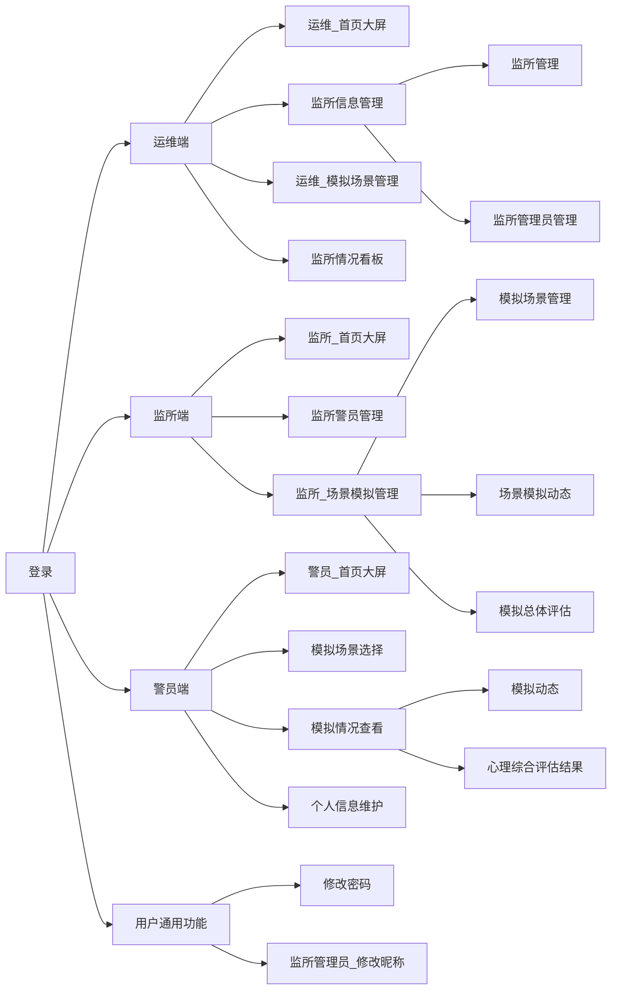
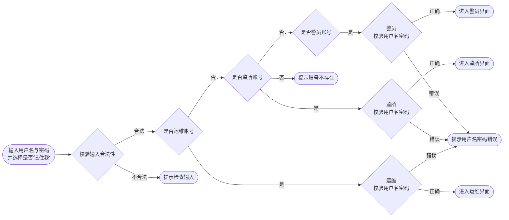
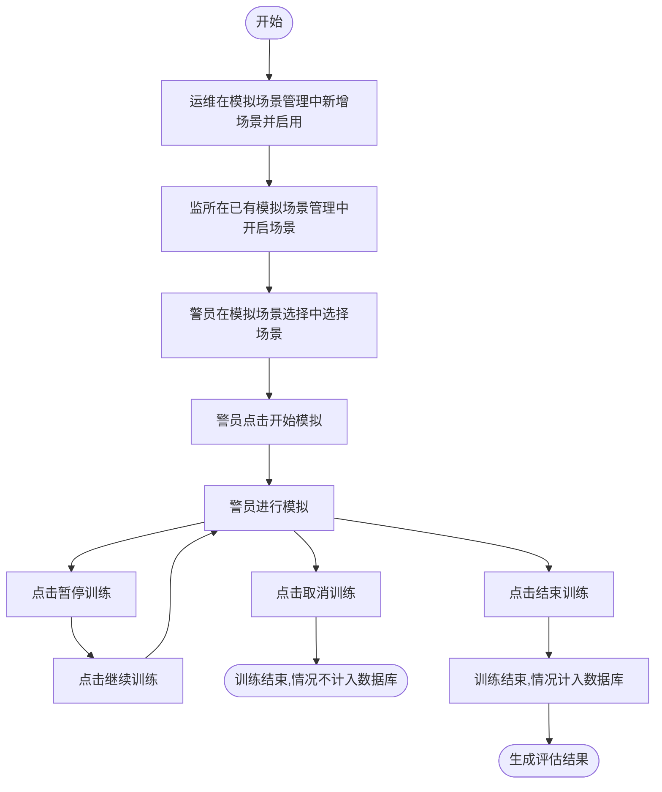
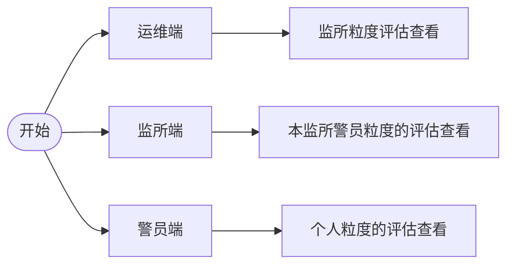

    <h1>
        监所警员心理保障与管理系统_软件结构设计说明_V1.0
    </h1>
    <h3>
        编写人员:王旻安,党艳,吴思赣    编写时间:2023.4.1
    </h3>

**文档评审记录**

  | 日期 | 文档版本 | 评审说明 | 评审人 |
  | ---- | -------- | -------- | ------ |
  |      |          |          |        |
  |      |          |          |        |
  |      |          |          |        |

## 1. 监所警员心理保障与管理系统体系结构设计

### 1.1 模块划分

总体上看，监所警员心理保障与管理系统分为四个模块。包括登录、运维端、监所端以及警员端。分别实现不同层级的功能。

### 1.2 模块层次结构关系

### 1.3 主要业务执行流程

#### 1.3.1 登录

#### 1.3.2 场景模拟

#### 1.3.3 评估查看

## 2. 监所警员心理保障与管理系统部件设计

### 4.1 运维端

#### 4.1.1 功能描述

作为运行维护人员登录时，对整个系统具有最高级的管理能力，主要包括查看网页使用记录，监所管理，模拟场景管理，查看监所情况分析，监所管理员管理这些主要能力

#### 4.1.2 部件组成

##### 4.1.2.1 部件一	首页大屏

使用运维账号登录后首先进入的页面，主要统计了网站的今日访问，今日模拟，本周模拟，历史流量，上周访问量和警员模拟动态的数据

效果如下：

##### 4.1.2.2 部件二	监所信息管理

包括监所管理和监所管理员管理两个页面

###### 4.1.2.2.1 监所管理

该页面能够对监所进行简单的管理，包括添加，删除和查找，还有能对一页显示监所的数量进行调整，和进行页面跳转

效果如下：

###### 4.1.2.2.2 监所管理员管理

该页面能够对监所管理员进行管理，与监所管理的逻辑基本相同，包括添加，删除和查找，还有能对一页显示监所管理员的数量进行调整，和进行页面跳转

效果如下：

##### 4.1.2.3 部件三	模拟场景管理

该页面能够对模拟场景进行管理，包括添加，删除和查找，还有能对一页显示监所管理员的数量进行调整，和进行页面跳转，以及对已有场景的启用与禁用，已有场景的信息修改

效果如下：

##### 4.1.2.4 部件四	监所情况看板

该页面能够提供各个监所的数据分析，包括情绪分析和评估结果

效果如下：

### 4.2 监所端

#### 4.2.1 功能描述

监所端提供看板，监所警员管理与场景模拟管理两大功能。看板展示了本监所警员本周内进行场景模拟的动态。其中监所警员管理允许监所管理员管理本监所所有警员。场景模拟管理分为三个部分。其中，模拟场景允许监所管理员为本监所启用或禁用模拟场景，场景模拟动态允许监所管理员查看本监所警员模拟动态。模拟总体评估允许监所管理员查看本监所警员评估具体结果。

#### 4.2.2 部件组成

##### 4.2.1 部件一 首页大屏

用于总览本监所警员场景模拟情况

##### 4.2.2 部件二 监所警员管理

用于新增修改删除本监所警员，同时可以查看本监所警员信息

##### 4.2.3 部件三 场景模拟管理

###### 4.2.3.1 模拟场景管理

用于为本监所启用模拟场景

###### 4.2.3.2 场景模拟动态

用于查看本监所警员场景模拟的历史信息

###### 4.2.3.3 模拟总体评估

用于查看监所警员模拟总体评估情况

### 4.3 警员端

#### 4.3.1 功能设计

警员端分为首页、模拟场景选择、模拟情况查看、个人信息维护四个模块。首页可以查看个人本周内进行场景模拟的动态信息。模拟场景选择允许警员选择已开启的场景并进行模拟。模拟情况查看分为模拟动态与心理评估综合结果；模拟动态用于查看个人模拟历史记录。心理评估综合结果用于查看个人总体情绪分析。个人信息维护用于修改个人基本信息。

#### 4.3.2 部件组成

##### 4.3.2.1 部件一 首页大屏

警员可以在该界面查看模拟情况

##### 4.3.2.2 部件二 模拟情况查看

###### 4.3.2.2.1 模拟动态

警员可以在该界面查看模拟的历史信息

###### 4.3.2.2.2 心理综合评估结果

警员可在该界面查看综合评估结果

#### 4.3.3 部件三 个人信息维护

警员可在该界面修改用户基本信息

### 4.4 通用功能

#### 4.4.1 功能设计

通用功能包括密码修改与用户昵称修改

用户可以在左侧下拉菜单中选择修改密码与修改昵称
