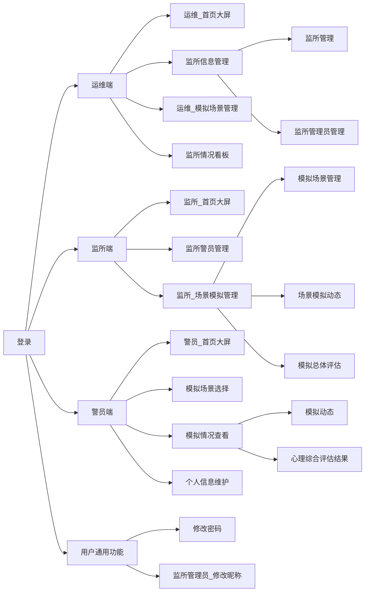

<div align="center">
    <h1>
        监所警员心理保障与管理系统_软件结构设计说明_V1.0
    </h1>
    <h3>
        编写人员:王旻安,党艳,吴思赣    编写时间:2023.4.1
    </h3>
</div>


**文档评审记录**


  | 日期 | 文档版本 | 评审说明 | 评审人 |
  | ---- | -------- | -------- | ------ |
  |      |          |          |        |
  |      |          |          |        |
  |      |          |          |        |


## 1. 监所警员心理保障与管理系统体系结构设计

### 1.1 模块划分

总体上看，监所警员心理保障与管理系统分为四个模块。包括登录、运维端、监所端以及警员端。分别实现不同层级的功能。


### 1.2 模块层次结构关系




### 1.3 主要业务执行流程

#### 1.3.1 登录


#### 1.3.2 场景模拟


#### 1.3.3 评估查看


## 2. 监所警员心理保障与管理系统部件设计

### 4.1 运维端

#### 4.1.1 功能描述

作为运行维护人员登录时，对整个系统具有最高级的管理能力，主要包括查看网页使用记录，监所管理，模拟场景管理，查看监所情况分析，监所管理员管理这些主要能力

#### 4.1.2 部件组成

##### 4.1.2.1 部件一	首页大屏

使用运维账号登录后首先进入的页面，主要统计了网站的今日访问，今日模拟，本周模拟，历史流量，上周访问量和警员模拟动态的数据

效果如下：


##### 4.1.2.2 部件二	监所信息管理

包括监所管理和监所管理员管理两个页面

###### 4.1.2.2.1 监所管理

该页面能够对监所进行简单的管理，包括添加，删除和查找，还有能对一页显示监所的数量进行调整，和进行页面跳转

效果如下：


###### 4.1.2.2.2 监所管理员管理

该页面能够对监所管理员进行管理，与监所管理的逻辑基本相同，包括添加，删除和查找，还有能对一页显示监所管理员的数量进行调整，和进行页面跳转

效果如下：


##### 4.1.2.3 部件三	模拟场景管理

该页面能够对模拟场景进行管理，包括添加，删除和查找，还有能对一页显示监所管理员的数量进行调整，和进行页面跳转，以及对已有场景的启用与禁用，已有场景的信息修改

效果如下：


##### 4.1.2.4 部件四	监所情况看板

该页面能够提供各个监所的数据分析，包括情绪分析和评估结果

效果如下：


#### 4.1.3 接口设计

##### GET 获取访问信息

GET /api/backstage-management-service/admin/stats

**获取访问信息**

数据和图表

**请求参数**

| 名称          | 位置   | 类型   | 必选 | 中文名 | 说明 |
| ------------- | ------ | ------ | ---- | ------ | ---- |
| Authorization | header | string | 否   |        | none |

> 返回示例

> 200 Response

```json
{
  "code": 0,
  "msg": "string",
  "data": {
    "accessCount": 0,
    "trainingCount": 0,
    "weeklyTrainingCount": 0,
    "flow": 0,
    "accessLastWeek": [
      0
    ]
  }
}
```

**返回结果**

| 状态码 | 状态码含义                                              | 说明 | 数据模型 |
| ------ | ------------------------------------------------------- | ---- | -------- |
| 200    | [OK](https://tools.ietf.org/html/rfc7231#section-6.3.1) | 成功 | Inline   |

**返回数据结构**

状态码 **200**

| 名称                   | 类型        | 必选 | 约束 | 中文名           | 说明                          |
| ---------------------- | ----------- | ---- | ---- | ---------------- | ----------------------------- |
| » code                 | integer     | true | none |                  | none                          |
| » msg                  | string      | true | none |                  | none                          |
| » data                 | object¦null | true | none |                  | none                          |
| »» accessCount         | integer     | true | none |                  | none                          |
| »» trainingCount       | integer     | true | none |                  | none                          |
| »» weeklyTrainingCount | integer     | true | none |                  | none                          |
| »» flow                | integer     | true | none | 流量             | none                          |
| »» accessLastWeek      | [integer]   | true | none | 上周每日访问流量 | 一个长度为7的数组，周一到周日 |

**GET 主页，动态模块**

GET /api/backstage-management-service/admin/mainPage/dynamic

在当前页面加载时请求，获取前三条训练记录情况

**请求参数**

| 名称          | 位置   | 类型   | 必选 | 中文名 | 说明 |
| ------------- | ------ | ------ | ---- | ------ | ---- |
| Authorization | header | string | 否   |        | none |

> 返回示例

> 200 Response

```json
{
  "code": 0,
  "msg": "string",
  "data": [
    {
      "policeName": "string",
      "modelName": "string",
      "startTime": "string",
      "endTime": "string"
    }
  ]
}
```

**返回结果**

| 状态码 | 状态码含义                                              | 说明 | 数据模型 |
| ------ | ------------------------------------------------------- | ---- | -------- |
| 200    | [OK](https://tools.ietf.org/html/rfc7231#section-6.3.1) | 成功 | Inline   |

**返回数据结构**

状态码 **200**

| 名称          | 类型          | 必选 | 约束 | 中文名 | 说明 |
| ------------- | ------------- | ---- | ---- | ------ | ---- |
| » code        | integer       | true | none |        | none |
| » msg         | string        | true | none |        | none |
| » data        | [object]¦null | true | none |        | none |
| »» policeName | string        | true | none |        | none |
| »» modelName  | string        | true | none |        | none |
| »» startTime  | string        | true | none |        | none |
| »» endTime    | string        | true | none |        | none |

##### GET 查询监所管理员

GET /api/backstage-management-service/admin/padmin

**查询监所管理员账号**

<code>query</code>为查询匹配的字符串

**请求参数**

| 名称          | 位置   | 类型    | 必选 | 中文名 | 说明              |
| ------------- | ------ | ------- | ---- | ------ | ----------------- |
| pageNum       | query  | integer | 否   |        | none              |
| pageSize      | query  | integer | 否   |        | none              |
| query         | query  | string  | 否   |        | 昵称/所属监所名称 |
| Authorization | header | string  | 否   |        | none              |

> 返回示例

> 200 Response

```json
{
  "code": 0,
  "msg": "string",
  "data": {
    "total": 0,
    "list": [
      {
        "nickname": "string",
        "accountNumber": "string",
        "prisonName": "string"
      }
    ]
  }
}
```

**返回结果**

| 状态码 | 状态码含义                                              | 说明 | 数据模型 |
| ------ | ------------------------------------------------------- | ---- | -------- |
| 200    | [OK](https://tools.ietf.org/html/rfc7231#section-6.3.1) | 成功 | Inline   |

**返回数据结构**

状态码 **200**

| 名称              | 类型        | 必选 | 约束 | 中文名   | 说明 |
| ----------------- | ----------- | ---- | ---- | -------- | ---- |
| » code            | integer     | true | none |          | none |
| » msg             | string      | true | none |          | none |
| » data            | object¦null | true | none |          | none |
| »» total          | integer     | true | none |          | none |
| »» list           | [object]    | true | none |          | none |
| »»» nickname      | string      | true | none | 昵称     | none |
| »»» accountNumber | string      | true | none | 账号     | none |
| »»» prisonName    | string      | true | none | 监所名称 | none |

##### POST 添加监所管理员

POST /api/backstage-management-service/admin/prison/padmin

**添加监所管理员**

昵称、密码默认与账号相同

> Body 请求参数

```json
{
  "prisonName": "string"
}
```

**请求参数**

| 名称          | 位置   | 类型   | 必选 | 中文名   | 说明 |
| ------------- | ------ | ------ | ---- | -------- | ---- |
| Authorization | header | string | 否   |          | none |
| body          | body   | object | 否   |          | none |
| » prisonName  | body   | string | 是   | 监所名称 | none |

> 返回示例

> 200 Response

```json
{
  "code": 0,
  "msg": "string",
  "data": {
    "id": "string",
    "nickname": "string",
    "accountNumber": "string"
  }
}
```

**返回结果**

| 状态码 | 状态码含义                                              | 说明 | 数据模型 |
| ------ | ------------------------------------------------------- | ---- | -------- |
| 200    | [OK](https://tools.ietf.org/html/rfc7231#section-6.3.1) | 成功 | Inline   |

**返回数据结构**

状态码 **200**

| 名称             | 类型        | 必选 | 约束 | 中文名 | 说明 |
| ---------------- | ----------- | ---- | ---- | ------ | ---- |
| » code           | integer     | true | none |        | none |
| » msg            | string      | true | none |        | none |
| » data           | object¦null | true | none |        | none |
| »» id            | string      | true | none |        | none |
| »» nickname      | string      | true | none | 昵称   | none |
| »» accountNumber | string      | true | none | 账号   | none |

**DELETE 批量删除监所管理员**

DELETE /api/backstage-management-service/admin/prison/padmin

**批量删除监所管理员**

> Body 请求参数

```json
{
  "idList": [
    0
  ]
}
```

**请求参数**

| 名称          | 位置   | 类型      | 必选 | 中文名 | 说明 |
| ------------- | ------ | --------- | ---- | ------ | ---- |
| Authorization | header | string    | 否   |        | none |
| body          | body   | object    | 否   |        | none |
| » idList      | body   | [integer] | 是   |        | none |

> 返回示例

> 200 Response

```json
{
  "code": 0,
  "msg": "string",
  "data": {}
}
```

**返回结果**

| 状态码 | 状态码含义                                              | 说明 | 数据模型                            |
| ------ | ------------------------------------------------------- | ---- | ----------------------------------- |
| 200    | [OK](https://tools.ietf.org/html/rfc7231#section-6.3.1) | 成功 | [CommonResult](#schemacommonresult) |

**POST 添加监所**

POST /api/backstage-management-service/admin/prison

**运维添加监所**

不允许添加相同的监所名称

> Body 请求参数

```json
{
  "prisonName": "string"
}
```

**请求参数**

| 名称          | 位置   | 类型   | 必选 | 中文名 | 说明 |
| ------------- | ------ | ------ | ---- | ------ | ---- |
| Authorization | header | string | 否   |        | none |
| body          | body   | object | 否   |        | none |
| » prisonName  | body   | string | 是   |        | none |

> 返回示例

> 200 Response

```json
{
  "code": 0,
  "msg": "string",
  "data": {}
}
```

**返回结果**

| 状态码 | 状态码含义                                              | 说明 | 数据模型                            |
| ------ | ------------------------------------------------------- | ---- | ----------------------------------- |
| 200    | [OK](https://tools.ietf.org/html/rfc7231#section-6.3.1) | 成功 | [CommonResult](#schemacommonresult) |

##### DELETE 批量删除监所

DELETE /api/backstage-management-service/admin/prison

**运维批量删除监所**

同时删除监所相关的管理员信息及警员信息

> Body 请求参数

```json
{
  "idList": [
    0
  ]
}
```

**请求参数**

| 名称          | 位置   | 类型      | 必选 | 中文名 | 说明 |
| ------------- | ------ | --------- | ---- | ------ | ---- |
| Authorization | header | string    | 否   |        | none |
| body          | body   | object    | 否   |        | none |
| » idList      | body   | [integer] | 是   |        | none |

> 返回示例

> 200 Response

```json
{
  "code": 0,
  "msg": "string",
  "data": {}
}
```

**返回结果**

| 状态码 | 状态码含义                                              | 说明 | 数据模型                            |
| ------ | ------------------------------------------------------- | ---- | ----------------------------------- |
| 200    | [OK](https://tools.ietf.org/html/rfc7231#section-6.3.1) | 成功 | [CommonResult](#schemacommonresult) |

##### GET 查询监所

GET /api/backstage-management-service/admin/prison

**查看所有监所**

分页

**请求参数**

| 名称          | 位置   | 类型    | 必选 | 中文名 | 说明     |
| ------------- | ------ | ------- | ---- | ------ | -------- |
| pageNum       | query  | integer | 否   |        | none     |
| pageSize      | query  | integer | 否   |        | none     |
| query         | query  | string  | 否   |        | 监所名称 |
| Authorization | header | string  | 否   |        | none     |

> 返回示例

> 200 Response

```json
{
  "code": 0,
  "msg": "string",
  "data": {
    "total": 0,
    "list": [
      {
        "name": "string"
      }
    ]
  }
}
```

**返回结果**

| 状态码 | 状态码含义                                              | 说明 | 数据模型 |
| ------ | ------------------------------------------------------- | ---- | -------- |
| 200    | [OK](https://tools.ietf.org/html/rfc7231#section-6.3.1) | 成功 | Inline   |

**返回数据结构**

状态码 **200**

| 名称     | 类型        | 必选 | 约束 | 中文名   | 说明 |
| -------- | ----------- | ---- | ---- | -------- | ---- |
| » code   | integer     | true | none |          | none |
| » msg    | string      | true | none |          | none |
| » data   | object¦null | true | none |          | none |
| »» total | integer     | true | none |          | none |
| »» list  | [object]    | true | none |          | none |
| »»» name | string      | true | none | 监所名称 | none |

##### POST 添加心理训练模型

POST /api/psychology-service/model

**添加心理训练模型**

默认启用该模型，
优先级默认为1，数字越小优先级越高

> Body 请求参数

```json
{
  "name": "string",
  "description": "string",
  "enable": true,
  "priority": 0
}
```

**请求参数**

| 名称          | 位置   | 类型    | 必选 | 中文名     | 说明 |
| ------------- | ------ | ------- | ---- | ---------- | ---- |
| Authorization | header | string  | 否   |            | none |
| body          | body   | object  | 否   |            | none |
| » name        | body   | string  | 是   |            | none |
| » description | body   | string  | 是   |            | none |
| » enable      | body   | boolean | 否   | 是否可使用 | none |
| » priority    | body   | integer | 否   | 排序优先级 | none |

> 返回示例

> 200 Response

```json
{
  "code": 0,
  "msg": "string",
  "data": {}
}
```

**返回结果**

| 状态码 | 状态码含义                                              | 说明 | 数据模型                            |
| ------ | ------------------------------------------------------- | ---- | ----------------------------------- |
| 200    | [OK](https://tools.ietf.org/html/rfc7231#section-6.3.1) | 成功 | [CommonResult](#schemacommonresult) |

##### DELETE 批量删除心理训练模型

DELETE /api/psychology-service/model

**批量删除心理训练模型**

> Body 请求参数

```json
{
  "idList": [
    0
  ]
}
```

**请求参数**

| 名称          | 位置   | 类型      | 必选 | 中文名 | 说明 |
| ------------- | ------ | --------- | ---- | ------ | ---- |
| Authorization | header | string    | 否   |        | none |
| body          | body   | object    | 否   |        | none |
| » idList      | body   | [integer] | 是   |        | none |

> 返回示例

> 200 Response

```json
{
  "code": 0,
  "msg": "string",
  "data": {}
}
```

**返回结果**

| 状态码 | 状态码含义                                              | 说明 | 数据模型                            |
| ------ | ------------------------------------------------------- | ---- | ----------------------------------- |
| 200    | [OK](https://tools.ietf.org/html/rfc7231#section-6.3.1) | 成功 | [CommonResult](#schemacommonresult) |

##### GET 查询心理训练模型

GET /api/psychology-service/model

**查询心理训练模型**

分页

**请求参数**

| 名称          | 位置   | 类型    | 必选 | 中文名 | 说明     |
| ------------- | ------ | ------- | ---- | ------ | -------- |
| pageNum       | query  | integer | 否   |        | 页码     |
| pageSize      | query  | integer | 否   |        | 页面容量 |
| query         | query  | string  | 否   |        | none     |
| Authorization | header | string  | 否   |        | none     |

> 返回示例

> 200 Response

```json
{
  "code": 0,
  "msg": "string",
  "data": {
    "total": 0,
    "list": [
      {
        "id": "string",
        "name": "string",
        "description": "string",
        "enable": true,
        "priority": 0
      }
    ]
  }
}
```

**返回结果**

| 状态码 | 状态码含义                                              | 说明 | 数据模型 |
| ------ | ------------------------------------------------------- | ---- | -------- |
| 200    | [OK](https://tools.ietf.org/html/rfc7231#section-6.3.1) | 成功 | Inline   |

**返回数据结构**

状态码 **200**

| 名称            | 类型        | 必选 | 约束 | 中文名     | 说明 |
| --------------- | ----------- | ---- | ---- | ---------- | ---- |
| » code          | integer     | true | none |            | none |
| » msg           | string      | true | none |            | none |
| » data          | object¦null | true | none |            | none |
| »» total        | integer     | true | none |            | none |
| »» list         | [object]    | true | none |            | none |
| »»» id          | string      | true | none |            | none |
| »»» name        | string      | true | none |            | none |
| »»» description | string      | true | none |            | none |
| »»» enable      | boolean     | true | none | 是否可使用 | none |
| »»» priority    | integer     | true | none | 排序优先级 | none |

##### PUT 修改心理训练模型

PUT /api/psychology-service/model/{modelId}

**修改心理训练模型，包括启用/禁用**

> Body 请求参数

```json
{
  "name": "string",
  "description": "string",
  "enable": true,
  "priority": 0
}
```

**请求参数**

| 名称          | 位置   | 类型    | 必选 | 中文名     | 说明 |
| ------------- | ------ | ------- | ---- | ---------- | ---- |
| modelId       | path   | string  | 是   |            | none |
| Authorization | header | string  | 否   |            | none |
| body          | body   | object  | 否   |            | none |
| » name        | body   | string  | 否   |            | none |
| » description | body   | string  | 否   |            | none |
| » enable      | body   | boolean | 否   | 是否可使用 | none |
| » priority    | body   | integer | 否   | 排序优先级 | none |

> 返回示例

> 200 Response

```json
{
  "code": 0,
  "msg": "string",
  "data": {}
}
```

**返回结果**

| 状态码 | 状态码含义                                              | 说明 | 数据模型                            |
| ------ | ------------------------------------------------------- | ---- | ----------------------------------- |
| 200    | [OK](https://tools.ietf.org/html/rfc7231#section-6.3.1) | 成功 | [CommonResult](#schemacommonresult) |

##### GET 查看评估统计

GET /api/psychology-service/assessment/{prisonId}

**平台运维查看某一监所评估统计结果**

图表方式呈现

**请求参数**

| 名称          | 位置   | 类型   | 必选 | 中文名 | 说明 |
| ------------- | ------ | ------ | ---- | ------ | ---- |
| prisonId      | path   | string | 是   |        | none |
| Authorization | header | string | 否   |        | none |

> 返回示例

> 200 Response

```json
{
  "code": 0,
  "msg": "string",
  "data": {
    "id": "string",
    "policeName": "string",
    "mentalPercenList": [
      0
    ],
    "result": true,
    "description": "string",
    "createTime": "string",
    "updateTime": "string"
  }
}
```

**返回结果**

| 状态码 | 状态码含义                                              | 说明 | 数据模型 |
| ------ | ------------------------------------------------------- | ---- | -------- |
| 200    | [OK](https://tools.ietf.org/html/rfc7231#section-6.3.1) | 成功 | Inline   |

**返回数据结构**

状态码 **200**

| 名称                | 类型        | 必选 | 约束 | 中文名 | 说明               |
| ------------------- | ----------- | ---- | ---- | ------ | ------------------ |
| » code              | integer     | true | none |        | none               |
| » msg               | string      | true | none |        | none               |
| » data              | object¦null | true | none |        | none               |
| »» id               | string      | true | none |        | none               |
| »» policeName       | string      | true | none |        | none               |
| »» mentalPercenList | [integer]   | true | none |        | 含有六个数字的数组 |
| »» result           | boolean     | true | none |        | none               |
| »» description      | string      | true | none |        | none               |
| »» createTime       | string      | true | none |        | none               |
| »» updateTime       | string      | true | none |        | none               |

### 4.2 监所端

#### 4.2.1 功能描述

监所端提供看板，监所警员管理与场景模拟管理两大功能。看板展示了本监所警员本周内进行场景模拟的动态。其中监所警员管理允许监所管理员管理本监所所有警员。场景模拟管理分为三个部分。其中，模拟场景允许监所管理员为本监所启用或禁用模拟场景，场景模拟动态允许监所管理员查看本监所警员模拟动态。模拟总体评估允许监所管理员查看本监所警员评估具体结果。

#### 4.2.2 接口设计

##### 管理系统/监所系统

###### PUT 更改监所管理员的昵称

PUT /api/backstage-management-service/prison/{prisonAdminId}

修改监所管理员的昵称

**请求参数**

| 名称          | 位置   | 类型   | 必选 | 说明 |
| ------------- | ------ | ------ | ---- | ---- |
| prisonAdminId | path   | string | 是   | none |
| newNickname   | query  | string | 否   | none |
| Authorization | header | string | 否   | none |

> 返回示例

> 200 Response

```json
{
  "code": 0,
  "msg": "string",
  "data": {}
}
```

**返回结果**

| 状态码 | 状态码含义                                              | 说明 | 数据模型                            |
| ------ | ------------------------------------------------------- | ---- | ----------------------------------- |
| 200    | [OK](https://tools.ietf.org/html/rfc7231#section-6.3.1) | 成功 | [CommonResult](#schemacommonresult) |


##### 管理系统/监所系统/主页

###### GET 顶部数据信息展示模块

GET /api/backstage-management-service/prison/mainPage

请求这个url直接得到主页展示的数据，展示顶层数据：启用训练模型 今日训练完成人次 今日在线人数 本周训练完成人次

**请求参数**

| 名称          | 位置   | 类型   | 必选 | 说明 |
| ------------- | ------ | ------ | ---- | ---- |
| Authorization | header | string | 否   | none |

> 返回示例

> 200 Response

```json
{
  "code": 0,
  "msg": "string",
  "data": {
    "workingModeNumber": "string",
    "finishTrainTimeDaily": "string",
    "loginTimeDaily": "string",
    "finishTrainTimeWeekly": "string"
  }
}
```

**返回结果**

| 状态码 | 状态码含义                                              | 说明 | 数据模型 |
| ------ | ------------------------------------------------------- | ---- | -------- |
| 200    | [OK](https://tools.ietf.org/html/rfc7231#section-6.3.1) | 成功 | Inline   |

**返回数据结构**

状态码 **200**

| 名称                     | 类型        | 必选 | 约束 | 中文名           | 说明 |
| ------------------------ | ----------- | ---- | ---- | ---------------- | ---- |
| » code                   | integer     | true | none |                  | none |
| » msg                    | string      | true | none |                  | none |
| » data                   | object¦null | true | none |                  | none |
| »» workingModeNumber     | string      | true | none | 启用训练模型     | none |
| »» finishTrainTimeDaily  | string      | true | none | 今日训练完成人次 | none |
| »» loginTimeDaily        | string      | true | none | 今日在线人数     | none |
| »» finishTrainTimeWeekly | string      | true | none | 本周训练完成人次 | none |

###### GET 主页，动态模块

GET /api/backstage-management-service/prison/mainPage/dynamic

仅加载时请求

**请求参数**

| 名称          | 位置   | 类型   | 必选 | 说明 |
| ------------- | ------ | ------ | ---- | ---- |
| Authorization | header | string | 否   | none |

> 返回示例

> 200 Response

```json
{
  "code": 0,
  "msg": "string",
  "data": [
    {
      "policeName": "string",
      "modelName": "string",
      "endTime": "string"
    }
  ]
}
```

**返回结果**

| 状态码 | 状态码含义                                              | 说明 | 数据模型 |
| ------ | ------------------------------------------------------- | ---- | -------- |
| 200    | [OK](https://tools.ietf.org/html/rfc7231#section-6.3.1) | 成功 | Inline   |

**返回数据结构**

状态码 **200**

| 名称          | 类型     | 必选 | 约束 | 中文名   | 说明 |
| ------------- | -------- | ---- | ---- | -------- | ---- |
| » code        | integer  | true | none |          | none |
| » msg         | string   | true | none |          | none |
| » data        | [object] | true | none |          | none |
| »» policeName | string   | true | none |          | none |
| »» modelName  | string   | true | none |          | none |
| »» endTime    | string   | true | none | 完成时间 | none |

###### GET 本周各场景模拟完成人次

GET /api/backstage-management-service/prison/mainPage/stats

本周本监所警员对各场景的完成人次，仅显示不为零的场景模型，且忽略超级管理员是否关闭了这个模型

**请求参数**

| 名称          | 位置   | 类型   | 必选 | 说明 |
| ------------- | ------ | ------ | ---- | ---- |
| Authorization | header | string | 否   | none |

> 返回示例

> 200 Response

```json
{
  "code": 0,
  "msg": "string",
  "data": [
    {
      "modelName": "string",
      "numberOfPolice": 0
    }
  ]
}
```

**返回结果**

| 状态码 | 状态码含义                                              | 说明 | 数据模型 |
| ------ | ------------------------------------------------------- | ---- | -------- |
| 200    | [OK](https://tools.ietf.org/html/rfc7231#section-6.3.1) | 成功 | Inline   |

**返回数据结构**

状态码 **200**

| 名称              | 类型     | 必选 | 约束 | 中文名                     | 说明 |
| ----------------- | -------- | ---- | ---- | -------------------------- | ---- |
| » code            | integer  | true | none |                            | none |
| » msg             | string   | true | none |                            | none |
| » data            | [object] | true | none |                            | none |
| »» modelName      | string   | true | none | 完成模拟的模型名称         | none |
| »» numberOfPolice | integer  | true | none | 完成该模拟的本监所警员人数 | none |


##### 管理系统/监所系统/监狱管理/警员信息管理

###### GET 查询功能-分页查询

GET /api/backstage-management-service/prison/police/query

对query字段进行全字段模糊查询
关于重置：建议点击重置后自动进行全员查询
关于分页： 页数大小可以设一个固定值，也可体现再页面上让用户定义，且即使是按id查询（肯定至多一个结果）也默认使用分页，不过只有一页罢了。

**请求参数**

| 名称          | 位置   | 类型   | 必选 | 说明 |
| ------------- | ------ | ------ | ---- | ---- |
| pageNum       | query  | string | 否   | none |
| pageSize      | query  | string | 否   | none |
| query         | query  | string | 否   | none |
| Authorization | header | string | 否   | none |

> 返回示例

> 200 Response

```json
{
  "code": 0,
  "msg": "string",
  "data": {
    "total": 0,
    "list": [
      {
        "id": 0,
        "name": "string",
        "imageUrl": "string",
        "accountNumber": "string"
      }
    ]
  }
}
```

**返回结果**

| 状态码 | 状态码含义                                              | 说明 | 数据模型 |
| ------ | ------------------------------------------------------- | ---- | -------- |
| 200    | [OK](https://tools.ietf.org/html/rfc7231#section-6.3.1) | 成功 | Inline   |

**返回数据结构**

状态码 **200**

| 名称              | 类型        | 必选 | 约束 | 中文名   | 说明   |
| ----------------- | ----------- | ---- | ---- | -------- | ------ |
| » code            | integer     | true | none |          | none   |
| » msg             | string      | true | none |          | none   |
| » data            | object¦null | true | none |          | none   |
| »» total          | integer     | true | none |          | 总页数 |
| »» list           | [object]    | true | none |          | none   |
| »»» id            | integer     | true | none | 警员id   | none   |
| »»» name          | string      | true | none | 警员姓名 | none   |
| »»» imageUrl      | string      | true | none | 头像url  | none   |
| »»» accountNumber | string      | true | none | 账号     | none   |

###### POST 新增警员

POST /api/backstage-management-service/prison/police

初始密码和警员编号相同

> Body 请求参数

```json
{
  "name": "string",
  "imageUrl": "string",
  "policeCode": "string"
}
```

**请求参数**

| 名称          | 位置   | 类型   | 必选 | 说明 |
| ------------- | ------ | ------ | ---- | ---- |
| Authorization | header | string | 否   | none |
| body          | body   | object | 否   | none |
| » name        | body   | string | 是   | none |
| » imageUrl    | body   | string | 是   | none |
| » policeCode  | body   | string | 是   | none |

> 返回示例

> 200 Response

```json
{
  "code": 0,
  "msg": "string",
  "data": {}
}
```

**返回结果**

| 状态码 | 状态码含义                                              | 说明 | 数据模型 |
| ------ | ------------------------------------------------------- | ---- | -------- |
| 200    | [OK](https://tools.ietf.org/html/rfc7231#section-6.3.1) | 成功 | Inline   |

**返回数据结构**

状态码 **200**

| 名称   | 类型        | 必选 | 约束 | 中文名 | 说明 |
| ------ | ----------- | ---- | ---- | ------ | ---- |
| » code | integer     | true | none |        | none |
| » msg  | string      | true | none |        | none |
| » data | object¦null | true | none |        | none |

###### DELETE 批量删除警员

DELETE /api/backstage-management-service/prison/police

传入一个警员id的数组

> Body 请求参数

```json
{
  "idList": [
    0
  ]
}
```

**请求参数**

| 名称          | 位置   | 类型      | 必选 | 说明 |
| ------------- | ------ | --------- | ---- | ---- |
| Authorization | header | string    | 否   | none |
| body          | body   | object    | 否   | none |
| » idList      | body   | [integer] | 是   | none |

> 返回示例

> 200 Response

```json
{
  "code": 0,
  "msg": "string",
  "data": {}
}
```

**返回结果**

| 状态码 | 状态码含义                                              | 说明 | 数据模型 |
| ------ | ------------------------------------------------------- | ---- | -------- |
| 200    | [OK](https://tools.ietf.org/html/rfc7231#section-6.3.1) | 成功 | Inline   |

**返回数据结构**

状态码 **200**

| 名称   | 类型        | 必选 | 约束 | 中文名 | 说明 |
| ------ | ----------- | ---- | ---- | ------ | ---- |
| » code | integer     | true | none |        | none |
| » msg  | string      | true | none |        | none |
| » data | object¦null | true | none |        | none |

###### PUT 修改警员信息

PUT /api/backstage-management-service/prison/police/{id}

三个参数均需要存在，不修改的字段使用原数据。

> Body 请求参数

```json
{
  "name": "string",
  "prisonName": "string",
  "imageUrl": "string"
}
```

**请求参数**

| 名称          | 位置   | 类型   | 必选 | 中文名   | 说明   |
| ------------- | ------ | ------ | ---- | -------- | ------ |
| id            | path   | string | 是   |          | 警员id |
| Authorization | header | string | 否   |          | none   |
| body          | body   | object | 否   |          | none   |
| » name        | body   | string | 是   | 警员姓名 | none   |
| » prisonName  | body   | string | 是   | 监狱名称 | none   |
| » imageUrl    | body   | string | 是   | 警员照片 | none   |

> 返回示例

> 200 Response

```json
{
  "code": 0,
  "msg": "string",
  "data": {}
}
```

**返回结果**

| 状态码 | 状态码含义                                              | 说明 | 数据模型 |
| ------ | ------------------------------------------------------- | ---- | -------- |
| 200    | [OK](https://tools.ietf.org/html/rfc7231#section-6.3.1) | 成功 | Inline   |

**返回数据结构**

状态码 **200**

| 名称   | 类型    | 必选  | 约束 | 中文名  | 说明 |
| ------ | ------- | ----- | ---- | ------- | ---- |
| » code | integer | true  | none | 200     | none |
| » msg  | string  | true  | none | success | none |
| » data | object  | false | none |         | none |

###### GET 获取所有监所列表

GET /api/backstage-management-service/prison/prison

用于转移警员到其他监所 所有的放一个列表里一起给我

```
{
    code: 200,
    msg: 'success',
    data: [
        '西安监狱',
        '上海监狱',
        '北京监狱',
        '南京监狱'
    ]
}
```

**请求参数**

| 名称          | 位置   | 类型   | 必选 | 中文名 | 说明 |
| ------------- | ------ | ------ | ---- | ------ | ---- |
| Authorization | header | string | 否   |        | none |

> 返回示例

> 200 Response

```json
{
  "code": 0,
  "msg": "string",
  "data": [
    "string"
  ]
}
```

**返回结果**

| 状态码 | 状态码含义                                              | 说明 | 数据模型 |
| ------ | ------------------------------------------------------- | ---- | -------- |
| 200    | [OK](https://tools.ietf.org/html/rfc7231#section-6.3.1) | 成功 | Inline   |

**返回数据结构**

状态码 **200**

| 名称   | 类型     | 必选 | 约束 | 中文名  | 说明 |
| ------ | -------- | ---- | ---- | ------- | ---- |
| » code | integer  | true | none | 200     | none |
| » msg  | string   | true | none | success | none |
| » data | [string] | true | none |         | none |


##### 管理系统/监所系统/训练内容管理/训练项目管理

###### GET 查询-分页

GET /api/backstage-management-service/prison/model

获得超级管理员开启了的训练模型的列表

**请求参数**

| 名称          | 位置   | 类型   | 必选 | 中文名 | 说明 |
| ------------- | ------ | ------ | ---- | ------ | ---- |
| pageNum       | query  | string | 否   |        | none |
| pageSize      | query  | string | 否   |        | none |
| query         | query  | string | 否   |        | none |
| Authorization | header | string | 否   |        | none |

> 返回示例

> 200 Response

```json
{
  "code": 0,
  "msg": "string",
  "data": {
    "total": 0,
    "list": [
      {
        "id": "string",
        "name": "string",
        "description": "string",
        "enable": true,
        "priority": 0
      }
    ]
  }
}
```

**返回结果**

| 状态码 | 状态码含义                                              | 说明 | 数据模型 |
| ------ | ------------------------------------------------------- | ---- | -------- |
| 200    | [OK](https://tools.ietf.org/html/rfc7231#section-6.3.1) | 成功 | Inline   |

**返回数据结构**

状态码 **200**

| 名称            | 类型        | 必选 | 约束 | 中文名     | 说明 |
| --------------- | ----------- | ---- | ---- | ---------- | ---- |
| » code          | integer     | true | none |            | none |
| » msg           | string      | true | none |            | none |
| » data          | object¦null | true | none |            | none |
| »» total        | integer     | true | none |            | none |
| »» list         | [object]    | true | none |            | none |
| »»» id          | string      | true | none |            | none |
| »»» name        | string      | true | none |            | none |
| »»» description | string      | true | none |            | none |
| »»» enable      | boolean     | true | none | 是否可使用 | none |
| »»» priority    | integer     | true | none | 排序优先级 | none |

###### PUT 修改该模型启用情况

PUT /api/backstage-management-service/prison/model/{id}

功能： 让监所管理员对警员打开活关闭训练模型
       以restful模式传入训练模型的id(String形式传，避免精度丢失，其实是long)，在请求体中传入
         enable字段决定是打开该模型还是关闭该模型； 监所管理员的身份识别由后端权限系统完成，无需传入身份识别参数

> Body 请求参数

```json
{
  "enable": true
}
```

**请求参数**

| 名称          | 位置   | 类型    | 必选 | 中文名   | 说明     |
| ------------- | ------ | ------- | ---- | -------- | -------- |
| id            | path   | string  | 是   |          | 模型编号 |
| Authorization | header | string  | 否   |          | none     |
| body          | body   | object  | 否   |          | none     |
| » enable      | body   | boolean | 是   | 是否启用 | none     |

> 返回示例

> 200 Response

```json
{}
```

**返回结果**

| 状态码 | 状态码含义                                              | 说明 | 数据模型 |
| ------ | ------------------------------------------------------- | ---- | -------- |
| 200    | [OK](https://tools.ietf.org/html/rfc7231#section-6.3.1) | 成功 | Inline   |

**返回数据结构**


##### 管理系统/监所系统/训练内容管理/训练动态查看

###### GET 详情页图标处理

GET /

图形我没太看懂，具体数据以前端需求而定

**请求参数**

| 名称          | 位置   | 类型   | 必选 | 中文名 | 说明 |
| ------------- | ------ | ------ | ---- | ------ | ---- |
| Authorization | header | string | 否   |        | none |

> 返回示例

> 200 Response

```json
{}
```

**返回结果**

| 状态码 | 状态码含义                                              | 说明 | 数据模型 |
| ------ | ------------------------------------------------------- | ---- | -------- |
| 200    | [OK](https://tools.ietf.org/html/rfc7231#section-6.3.1) | 成功 | Inline   |

**返回数据结构**

###### GET 获得训练模型下拉框的数据

GET /api/backstage-management-service/prison/trainDynamic

我认为训练模型换成下拉框而不是输入框更加合适
gxl:获得所有被超级管理员打开的训练模型的名字
         无任何参数传入

**请求参数**

| 名称          | 位置   | 类型   | 必选 | 中文名 | 说明 |
| ------------- | ------ | ------ | ---- | ------ | ---- |
| Authorization | header | string | 否   |        | none |

> 返回示例

> 200 Response

```json
{
  "code": 0,
  "msg": "string",
  "data": [
    "string"
  ]
}
```

**返回结果**

| 状态码 | 状态码含义                                              | 说明 | 数据模型 |
| ------ | ------------------------------------------------------- | ---- | -------- |
| 200    | [OK](https://tools.ietf.org/html/rfc7231#section-6.3.1) | 成功 | Inline   |

**返回数据结构**

状态码 **200**

| 名称   | 类型     | 必选 | 约束 | 中文名                     | 说明 |
| ------ | -------- | ---- | ---- | -------------------------- | ---- |
| » code | integer  | true | none |                            | none |
| » msg  | string   | true | none |                            | none |
| » data | [string] | true | none | 一个包含所有模型名称的数组 | none |

###### GET 查询-分页

GET /api/backstage-management-service/prison/dynamic/query

这里的police只在警员名称、警员编号之间进行模糊查询
modelName为选中的场景名称
二者都有可能是空参 全空参则全查
gxl:作用： 通过输入警员模糊特征信息和模型准确全名，对本监所的警员关于该模型训练结果进行模糊查询

**请求参数**

| 名称          | 位置   | 类型   | 必选 | 中文名 | 说明 |
| ------------- | ------ | ------ | ---- | ------ | ---- |
| pageNum       | query  | string | 否   |        | none |
| pageSize      | query  | string | 否   |        | none |
| police        | query  | string | 否   |        | none |
| modelName     | query  | string | 否   |        | none |
| Authorization | header | string | 否   |        | none |

> 返回示例

> 200 Response

```json
{
  "code": 0,
  "msg": "string",
  "data": {
    "total": 0,
    "list": [
      {
        "id": "string",
        "policeId": "string",
        "policeName": "string",
        "modelId": "string",
        "modelName": "string",
        "status": "string",
        "result": "string",
        "startTime": "string",
        "endTime": "string"
      }
    ]
  }
}
```

**返回结果**

| 状态码 | 状态码含义                                              | 说明 | 数据模型 |
| ------ | ------------------------------------------------------- | ---- | -------- |
| 200    | [OK](https://tools.ietf.org/html/rfc7231#section-6.3.1) | 成功 | Inline   |

**返回数据结构**

状态码 **200**

| 名称           | 类型        | 必选 | 约束 | 中文名 | 说明 |
| -------------- | ----------- | ---- | ---- | ------ | ---- |
| » code         | integer     | true | none |        | none |
| » msg          | string      | true | none |        | none |
| » data         | object¦null | true | none |        | none |
| »» total       | integer     | true | none |        | none |
| »» list        | [object]    | true | none |        | none |
| »»» id         | string      | true | none |        | none |
| »»» policeId   | string      | true | none |        | none |
| »»» policeName | string      | true | none |        | none |
| »»» modelId    | string      | true | none |        | none |
| »»» modelName  | string      | true | none |        | none |
| »»» status     | string      | true | none |        | none |
| »»» result     | string      | true | none |        | none |
| »»» startTime  | string      | true | none |        | none |
| »»» endTime    | string      | true | none |        | none |

##### 管理系统/监所系统/训练内容管理/总体训练评估

###### GET 查询-分页

GET /api/backstage-management-service/prison/totalAssess

将某个警员的综合评估记录进行展示，模糊全查询范围： 警员编号（也就是账号），警员姓名，评估描述

**请求参数**

| 名称          | 位置   | 类型   | 必选 | 中文名 | 说明 |
| ------------- | ------ | ------ | ---- | ------ | ---- |
| pageSize      | query  | string | 否   |        | none |
| pageNum       | query  | string | 否   |        | none |
| query         | query  | string | 否   |        | none |
| Authorization | header | string | 否   |        | none |

> 返回示例

> 200 Response

```json
{
  "code": 0,
  "msg": "string",
  "data": {
    "total": 0,
    "list": [
      {
        "id": "string",
        "policeName": "string",
        "mentalPercentList": [
          0
        ],
        "result": true,
        "description": "string",
        "createTime": "string",
        "updateTime": "string"
      }
    ]
  }
}
```

**返回结果**

| 状态码 | 状态码含义                                              | 说明 | 数据模型 |
| ------ | ------------------------------------------------------- | ---- | -------- |
| 200    | [OK](https://tools.ietf.org/html/rfc7231#section-6.3.1) | 成功 | Inline   |

**返回数据结构**

状态码 **200**

| 名称                  | 类型      | 必选 | 约束 | 中文名               | 说明                                                         |
| --------------------- | --------- | ---- | ---- | -------------------- | ------------------------------------------------------------ |
| » code                | integer   | true | none |                      | none                                                         |
| » msg                 | string    | true | none |                      | none                                                         |
| » data                | object    | true | none |                      | none                                                         |
| »» total              | integer   | true | none |                      | none                                                         |
| »» list               | [object]  | true | none |                      | none                                                         |
| »»» id                | string    | true | none |                      | none                                                         |
| »»» policeName        | string    | true | none | 警员姓名             | none                                                         |
| »»» mentalPercentList | [integer] | true | none |                      | 心理状态,形如[10,10,10,10,10,50],以六种基本情绪为对应,顺序为：愤怒（anger）、厌恶（disgust）、恐惧（fear）、幸福（happiness）、悲伤（sadness）和惊喜（surprise） |
| »»» result            | boolean   | true | none | 结果是否在正常范围内 | none                                                         |
| »»» description       | string    | true | none |                      | none                                                         |
| »»» createTime        | string    | true | none | 创建评估的时间       | none                                                         |
| »»» updateTime        | string    | true | none | 更新评估的时间       | none                                                         |

###### DELETE 删除-多个

DELETE /api/backstage-management-service/prison/totalAssess

> Body 请求参数

```json
{
  "idList": [
    "string"
  ]
}
```

**请求参数**

| 名称          | 位置   | 类型     | 必选 | 中文名 | 说明 |
| ------------- | ------ | -------- | ---- | ------ | ---- |
| Authorization | header | string   | 否   |        | none |
| body          | body   | object   | 否   |        | none |
| » idList      | body   | [string] | 是   |        | none |

> 返回示例

> 200 Response

```json
{
  "code": 0,
  "msg": "string",
  "data": {}
}
```

**返回结果**

| 状态码 | 状态码含义                                              | 说明 | 数据模型 |
| ------ | ------------------------------------------------------- | ---- | -------- |
| 200    | [OK](https://tools.ietf.org/html/rfc7231#section-6.3.1) | 成功 | Inline   |

**返回数据结构**

状态码 **200**

| 名称   | 类型        | 必选 | 约束 | 中文名 | 说明 |
| ------ | ----------- | ---- | ---- | ------ | ---- |
| » code | integer     | true | none |        | none |
| » msg  | string      | true | none |        | none |
| » data | object¦null | true | none |        | none |


##### 管理系统/监所系统/监狱训练分布

###### GET 获取页面数据

GET /api/backstage-management-service/prison/training

已废弃的页面和接口

**请求参数**

| 名称          | 位置   | 类型   | 必选 | 中文名 | 说明 |
| ------------- | ------ | ------ | ---- | ------ | ---- |
| Authorization | header | string | 否   |        | none |

> 返回示例

> 200 Response

```json
{
  "code": 0,
  "msg": "string",
  "data": {
    "accessDaliy": "string",
    "trainTimeDaily": "string",
    "trainTimeWeekly": "string"
  }
}
```

**返回结果**

| 状态码 | 状态码含义                                              | 说明 | 数据模型 |
| ------ | ------------------------------------------------------- | ---- | -------- |
| 200    | [OK](https://tools.ietf.org/html/rfc7231#section-6.3.1) | 成功 | Inline   |

**返回数据结构**

状态码 **200**

| 名称               | 类型        | 必选 | 约束 | 中文名         | 说明 |
| ------------------ | ----------- | ---- | ---- | -------------- | ---- |
| » code             | integer     | true | none |                | none |
| » msg              | string      | true | none |                | none |
| » data             | object¦null | true | none |                | none |
| »» accessDaliy     | string      | true | none | 今日警员访问数 | none |
| »» trainTimeDaily  | string      | true | none | 今日训练人次   | none |
| »» trainTimeWeekly | string      | true | none | 本周训练人次   | none |


##### 数据模型

<h6 id="tocS_CommonResult">CommonResult</h6>

<a id="schemacommonresult"></a>
<a id="schema_CommonResult"></a>
<a id="tocScommonresult"></a>
<a id="tocscommonresult"></a>

```json
{
  "code": 0,
  "msg": "string",
  "data": {}
}

```

通用返回

**属性**

| 名称 | 类型        | 必选 | 约束 | 中文名 | 说明 |
| ---- | ----------- | ---- | ---- | ------ | ---- |
| code | integer     | true | none |        | none |
| msg  | string      | true | none |        | none |
| data | object¦null | true | none |        | none |

<h6 id="tocS_训练模型">训练模型</h6>

<a id="schema训练模型"></a>
<a id="schema_训练模型"></a>
<a id="tocS训练模型"></a>
<a id="tocs训练模型"></a>

```json
{
  "id": "string",
  "name": "string",
  "description": "string",
  "enable": true,
  "priority": 0
}

```

训练模型

**属性**

| 名称        | 类型    | 必选 | 约束 | 中文名     | 说明 |
| ----------- | ------- | ---- | ---- | ---------- | ---- |
| id          | string  | true | none |            | none |
| name        | string  | true | none |            | none |
| description | string  | true | none |            | none |
| enable      | boolean | true | none | 是否可使用 | none |
| priority    | integer | true | none | 排序优先级 | none |


### 4.3 警员端

#### 4.3.1 功能设计

警员端分为首页、模拟场景选择、模拟情况查看、个人信息维护四个模块。首页可以查看个人本周内进行场景模拟的动态信息。模拟场景选择允许警员选择已开启的场景并进行模拟。模拟情况查看分为模拟动态与心理评估综合结果；模拟动态用于查看个人模拟历史记录。心理评估综合结果用于查看个人总体情绪分析。个人信息维护用于修改个人基本信息。

#### 4.3.2 接口设计

##### 管理系统/警员系统/训练情况查看/个人动态

###### GET 查询-分页

GET /api/backstage-management-service/police/query

此处query只对model表进行全列查询，得到的数据肯定都是登录警员的。query为空则全查询
gxl: 警员系统查询自己关于某个模型的训练记录，模型采用全模糊查询

**请求参数**

| 名称          | 位置   | 类型   | 必选 | 说明 |
| ------------- | ------ | ------ | ---- | ---- |
| pageNum       | query  | string | 否   | none |
| pageSize      | query  | string | 否   | none |
| query         | query  | string | 否   | none |
| Authorization | header | string | 否   | none |

> 返回示例

> 200 Response

```json
{
  "code": 0,
  "msg": "string",
  "data": {
    "total": 0,
    "list": [
      {
        "id": "string",
        "modelId": "string",
        "modelName": "string",
        "status": "string",
        "result": "string",
        "startTime": "string",
        "endTime": "string"
      }
    ]
  }
}
```

**返回结果**

| 状态码 | 状态码含义                                              | 说明 | 数据模型 |
| ------ | ------------------------------------------------------- | ---- | -------- |
| 200    | [OK](https://tools.ietf.org/html/rfc7231#section-6.3.1) | 成功 | Inline   |

**返回数据结构**

状态码 **200**

| 名称          | 类型        | 必选 | 约束 | 中文名 | 说明 |
| ------------- | ----------- | ---- | ---- | ------ | ---- |
| » code        | integer     | true | none |        | none |
| » msg         | string      | true | none |        | none |
| » data        | object¦null | true | none |        | none |
| »» total      | integer     | true | none |        | none |
| »» list       | [object]    | true | none |        | none |
| »»» id        | string      | true | none |        | none |
| »»» modelId   | string      | true | none |        | none |
| »»» modelName | string      | true | none |        | none |
| »»» status    | string      | true | none |        | none |
| »»» result    | string      | true | none |        | none |
| »»» startTime | string      | true | none |        | none |
| »»» endTime   | string      | true | none |        | none |


##### 管理系统/警员系统/训练情况查看/心理问题管理

###### GET 获得数据

GET /api/backstage-management-service/police/totalResult

警员系统获取自己的综合评估数据

**请求参数**

| 名称          | 位置   | 类型   | 必选 | 说明 |
| ------------- | ------ | ------ | ---- | ---- |
| Authorization | header | string | 否   | none |

> 返回示例

> 200 Response

```json
{
  "code": 0,
  "msg": "string",
  "data": {
    "id": 0,
    "mentalPercentList": [
      0
    ],
    "result": true,
    "description": "string",
    "createTime": "string",
    "updateTime": "string"
  }
}
```

**返回结果**

| 状态码 | 状态码含义                                              | 说明 | 数据模型 |
| ------ | ------------------------------------------------------- | ---- | -------- |
| 200    | [OK](https://tools.ietf.org/html/rfc7231#section-6.3.1) | 成功 | Inline   |

**返回数据结构**

状态码 **200**

| 名称                 | 类型        | 必选 | 约束 | 中文名 | 说明               |
| -------------------- | ----------- | ---- | ---- | ------ | ------------------ |
| » code               | integer     | true | none |        | none               |
| » msg                | string      | true | none |        | none               |
| » data               | object¦null | true | none |        | none               |
| »» id                | integer     | true | none |        | none               |
| »» mentalPercentList | [integer]   | true | none |        | 含有六个数字的数组 |
| »» result            | boolean     | true | none |        | none               |
| »» description       | string      | true | none |        | none               |
| »» createTime        | string      | true | none |        | none               |
| »» updateTime        | string      | true | none |        | none               |


##### 管理系统/警员系统/警员训练与评估

###### POST 警员开始训练

POST /api/backstage-management-service/training/{modelId}

**警员选择特定的心理模型开始训练**

必须是已登录的警员，模型已启用
默认开始时间为当前时间，结束时间为当前时间+1小时
同一警员同一时间只能进行一个训练

> Body 请求参数

```json
{}
```

**请求参数**

| 名称          | 位置   | 类型   | 必选 | 说明 |
| ------------- | ------ | ------ | ---- | ---- |
| modelId       | path   | string | 是   | none |
| Authorization | header | string | 否   | none |
| body          | body   | object | 否   | none |

> 返回示例

> 200 Response

```json
{
  "code": 0,
  "msg": "string",
  "data": "string"
}
```

**返回结果**

| 状态码 | 状态码含义                                              | 说明 | 数据模型 |
| ------ | ------------------------------------------------------- | ---- | -------- |
| 200    | [OK](https://tools.ietf.org/html/rfc7231#section-6.3.1) | 成功 | Inline   |

**返回数据结构**

状态码 **200**

| 名称   | 类型        | 必选 | 约束 | 中文名 | 说明 |
| ------ | ----------- | ---- | ---- | ------ | ---- |
| » code | integer     | true | none |        | none |
| » msg  | string      | true | none |        | none |
| » data | string¦null | true | none |        | none |

###### GET 查询可用的心理训练模型

GET /api/backstage-management-service/model

**查询心理训练模型**

分页

**请求参数**

| 名称          | 位置   | 类型    | 必选 | 说明     |
| ------------- | ------ | ------- | ---- | -------- |
| pageNum       | query  | integer | 否   | 页码     |
| pageSize      | query  | integer | 否   | 页面容量 |
| query         | query  | string  | 否   | none     |
| Authorization | header | string  | 否   | none     |

> 返回示例

> 200 Response

```json
{
  "code": 0,
  "msg": "string",
  "data": {
    "total": 0,
    "list": [
      {
        "id": "string",
        "name": "string",
        "description": "string",
        "enable": true,
        "priority": 0
      }
    ]
  }
}
```

**返回结果**

| 状态码 | 状态码含义                                              | 说明 | 数据模型 |
| ------ | ------------------------------------------------------- | ---- | -------- |
| 200    | [OK](https://tools.ietf.org/html/rfc7231#section-6.3.1) | 成功 | Inline   |

**返回数据结构**

状态码 **200**

| 名称            | 类型        | 必选 | 约束 | 中文名                               | 说明 |
| --------------- | ----------- | ---- | ---- | ------------------------------------ | ---- |
| » code          | integer     | true | none |                                      | none |
| » msg           | string      | true | none |                                      | none |
| » data          | object¦null | true | none |                                      | none |
| »» total        | integer     | true | none |                                      | none |
| »» list         | [object]    | true | none |                                      | none |
| »»» id          | string      | true | none |                                      | none |
| »»» name        | string      | true | none |                                      | none |
| »»» description | string      | true | none |                                      | none |
| »»» enable      | boolean     | true | none | 是否可使用，须同时在运维、监所处启用 | none |
| »»» priority    | integer     | true | none | 排序优先级                           | none |

###### PUT 暂停/继续训练

PUT /api/backstage-management-service/training/{trainingId}

**请求参数**

| 名称          | 位置   | 类型   | 必选 | 说明 |
| ------------- | ------ | ------ | ---- | ---- |
| trainingId    | path   | string | 是   | none |
| Authorization | header | string | 否   | none |

> 返回示例

> 200 Response

```json
{
  "code": 0,
  "msg": "string",
  "data": {}
}
```

**返回结果**

| 状态码 | 状态码含义                                              | 说明 | 数据模型 |
| ------ | ------------------------------------------------------- | ---- | -------- |
| 200    | [OK](https://tools.ietf.org/html/rfc7231#section-6.3.1) | 成功 | Inline   |

**返回数据结构**

状态码 **200**

| 名称   | 类型        | 必选 | 约束 | 中文名 | 说明 |
| ------ | ----------- | ---- | ---- | ------ | ---- |
| » code | integer     | true | none |        | none |
| » msg  | string      | true | none |        | none |
| » data | object¦null | true | none |        | none |

###### GET 结束训练

GET /api/backstage-management-service/training/{trainingId}

**请求参数**

| 名称          | 位置   | 类型   | 必选 | 说明 |
| ------------- | ------ | ------ | ---- | ---- |
| trainingId    | path   | string | 是   | none |
| Authorization | header | string | 否   | none |

> 返回示例

> 200 Response

```json
{
  "code": 0,
  "msg": "string",
  "data": {}
}
```

**返回结果**

| 状态码 | 状态码含义                                              | 说明 | 数据模型 |
| ------ | ------------------------------------------------------- | ---- | -------- |
| 200    | [OK](https://tools.ietf.org/html/rfc7231#section-6.3.1) | 成功 | Inline   |

**返回数据结构**

状态码 **200**

| 名称   | 类型        | 必选 | 约束 | 中文名 | 说明 |
| ------ | ----------- | ---- | ---- | ------ | ---- |
| » code | integer     | true | none |        | none |
| » msg  | string      | true | none |        | none |
| » data | object¦null | true | none |        | none |

###### DELETE 取消训练

DELETE /api/backstage-management-service/training/{trainingId}

**请求参数**

| 名称          | 位置   | 类型   | 必选 | 说明 |
| ------------- | ------ | ------ | ---- | ---- |
| trainingId    | path   | string | 是   | none |
| Authorization | header | string | 否   | none |

> 返回示例

> 200 Response

```json
{
  "code": 0,
  "msg": "string",
  "data": {}
}
```

**返回结果**

| 状态码 | 状态码含义                                              | 说明 | 数据模型 |
| ------ | ------------------------------------------------------- | ---- | -------- |
| 200    | [OK](https://tools.ietf.org/html/rfc7231#section-6.3.1) | 成功 | Inline   |

**返回数据结构**

状态码 **200**

| 名称   | 类型        | 必选 | 约束 | 中文名 | 说明 |
| ------ | ----------- | ---- | ---- | ------ | ---- |
| » code | integer     | true | none |        | none |
| » msg  | string      | true | none |        | none |
| » data | object¦null | true | none |        | none |


##### 管理系统/警员系统/个人信息

###### PUT 警员修改个人信息

PUT /api/backstage-management-service/police/profile/{id}

**警员修改个人信息**

适用于警员更改头像，姓名、所属监所发生变动时

> Body 请求参数

```json
{
  "name": "string",
  "imageUrl": "string"
}
```

**请求参数**

| 名称          | 位置   | 类型   | 必选 | 中文名  | 说明 |
| ------------- | ------ | ------ | ---- | ------- | ---- |
| id            | path   | string | 是   |         | none |
| Authorization | header | string | 否   |         | none |
| body          | body   | object | 否   |         | none |
| » name        | body   | string | 否   | 姓名    | none |
| » imageUrl    | body   | string | 否   | 头像url | none |

> 返回示例

> 200 Response

```json
{
  "code": 0,
  "msg": "string",
  "data": {}
}
```

**返回结果**

| 状态码 | 状态码含义                                              | 说明 | 数据模型                            |
| ------ | ------------------------------------------------------- | ---- | ----------------------------------- |
| 200    | [OK](https://tools.ietf.org/html/rfc7231#section-6.3.1) | 成功 | [CommonResult](#schemacommonresult) |

###### GET 查看个人信息

GET /api/backstage-management-service/police/profile

**警员查看自己的个人信息**

> Body 请求参数

```json
{}
```

**请求参数**

| 名称          | 位置   | 类型   | 必选 | 中文名 | 说明 |
| ------------- | ------ | ------ | ---- | ------ | ---- |
| Authorization | header | string | 否   |        | none |
| body          | body   | object | 否   |        | none |

> 返回示例

> 200 Response

```json
{
  "code": 0,
  "msg": "string",
  "data": {
    "id": "string",
    "name": "string",
    "imageUrl": "string",
    "accountNumber": "string",
    "prisonName": "string"
  }
}
```

**返回结果**

| 状态码 | 状态码含义                                              | 说明 | 数据模型 |
| ------ | ------------------------------------------------------- | ---- | -------- |
| 200    | [OK](https://tools.ietf.org/html/rfc7231#section-6.3.1) | 成功 | Inline   |

**返回数据结构**

状态码 **200**

| 名称             | 类型        | 必选 | 约束 | 中文名   | 说明 |
| ---------------- | ----------- | ---- | ---- | -------- | ---- |
| » code           | integer     | true | none |          | none |
| » msg            | string      | true | none |          | none |
| » data           | object¦null | true | none |          | none |
| »» id            | string      | true | none | 警员id   | none |
| »» name          | string      | true | none | 警员姓名 | none |
| »» imageUrl      | string      | true | none | 头像url  | none |
| »» accountNumber | string      | true | none | 账号     | none |
| »» prisonName    | string      | true | none | 监所名称 | none |


##### 管理系统/警员系统/首页

###### GET 首页-训练情况

GET /api/backstage-management-service/police/home/training


##### 首页-训练情况

包括**今日训练任务**，**今日训练模型完成数**，**本周训练模型完成数**

**请求参数**

| 名称          | 位置   | 类型   | 必选 | 中文名 | 说明 |
| ------------- | ------ | ------ | ---- | ------ | ---- |
| Authorization | header | string | 否   |        | none |

> 返回示例

> 200 Response

```json
{
  "code": 0,
  "msg": "string",
  "data": {
    "dailyTasks": 0,
    "dailyCompletedTasks": 0,
    "weeklyModels": 0
  }
}
```

**返回结果**

| 状态码 | 状态码含义                                              | 说明 | 数据模型 |
| ------ | ------------------------------------------------------- | ---- | -------- |
| 200    | [OK](https://tools.ietf.org/html/rfc7231#section-6.3.1) | 成功 | Inline   |

**返回数据结构**

状态码 **200**

| 名称                   | 类型        | 必选 | 约束 | 中文名                                | 说明         |
| ---------------------- | ----------- | ---- | ---- | ------------------------------------- | ------------ |
| » code                 | integer     | true | none |                                       | none         |
| » msg                  | string      | true | none |                                       | none         |
| » data                 | object¦null | true | none |                                       | none         |
| »» dailyTasks          | integer     | true | none | 包括已完成/进行中和未完成的训练模型数 | 今日总计模拟 |
| »» dailyCompletedTasks | integer     | true | none |                                       | 今日完成模拟 |
| »» weeklyModels        | integer     | true | none |                                       | 本周总计模拟 |

###### GET 首页-警员动态

GET /api/backstage-management-service/police/home/dynamic

在当前页面加载时请求，获取警员自身前三条训练记录情况

**请求参数**

| 名称          | 位置   | 类型   | 必选 | 中文名 | 说明 |
| ------------- | ------ | ------ | ---- | ------ | ---- |
| Authorization | header | string | 否   |        | none |

> 返回示例

> 200 Response

```json
{
  "code": 0,
  "msg": "string",
  "data": [
    {
      "modelName": "string",
      "startTime": "string",
      "endTime": "string"
    }
  ]
}
```

**返回结果**

| 状态码 | 状态码含义                                              | 说明 | 数据模型 |
| ------ | ------------------------------------------------------- | ---- | -------- |
| 200    | [OK](https://tools.ietf.org/html/rfc7231#section-6.3.1) | 成功 | Inline   |

**返回数据结构**

状态码 **200**

| 名称         | 类型          | 必选 | 约束 | 中文名       | 说明 |
| ------------ | ------------- | ---- | ---- | ------------ | ---- |
| » code       | integer       | true | none |              | none |
| » msg        | string        | true | none |              | none |
| » data       | [object]¦null | true | none |              | none |
| »» modelName | string        | true | none | 模型名       | none |
| »» startTime | string        | true | none | 开始训练时间 | none |
| »» endTime   | string        | true | none | 完成训练时间 | none |

###### GET 首页-本周训练情况

GET /api/backstage-management-service/police/home/weekTraining

本周训练情况（用于生成图表）
获取当前周（从周日起）每天的训练次数

**请求参数**

| 名称          | 位置   | 类型   | 必选 | 中文名 | 说明 |
| ------------- | ------ | ------ | ---- | ------ | ---- |
| Authorization | header | string | 否   |        | none |

> 返回示例

> 200 Response

```json
{
  "code": 0,
  "msg": "string",
  "data": [
    0
  ]
}
```

**返回结果**

| 状态码 | 状态码含义                                              | 说明 | 数据模型 |
| ------ | ------------------------------------------------------- | ---- | -------- |
| 200    | [OK](https://tools.ietf.org/html/rfc7231#section-6.3.1) | 成功 | Inline   |

**返回数据结构**

状态码 **200**

| 名称   | 类型           | 必选 | 约束 | 中文名   | 说明 |
| ------ | -------------- | ---- | ---- | -------- | ---- |
| » code | integer        | true | none |          | none |
| » msg  | string         | true | none |          | none |
| » data | [integer]¦null | true | none | 训练次数 | none |

###### GET 首页-确认是否在训练中

GET /api/backstage-management-service/police/home/isTraining

**请求参数**

| 名称          | 位置   | 类型   | 必选 | 中文名 | 说明 |
| ------------- | ------ | ------ | ---- | ------ | ---- |
| Authorization | header | string | 否   |        | none |

> 返回示例

> 200 Response

```json
{
  "code": 0,
  "msg": "string",
  "data": {
    "isTraining": true
  }
}
```

**返回结果**

| 状态码 | 状态码含义                                              | 说明 | 数据模型 |
| ------ | ------------------------------------------------------- | ---- | -------- |
| 200    | [OK](https://tools.ietf.org/html/rfc7231#section-6.3.1) | 成功 | Inline   |

**返回数据结构**

状态码 **200**

| 名称          | 类型        | 必选 | 约束 | 中文名 | 说明 |
| ------------- | ----------- | ---- | ---- | ------ | ---- |
| » code        | integer     | true | none |        | none |
| » msg         | string      | true | none |        | none |
| » data        | object¦null | true | none |        | none |
| »» isTraining | boolean     | true | none |        | none |


##### 数据模型

<h6 id="tocS_训练模型">训练模型</h6>

<a id="schema训练模型"></a>
<a id="schema_训练模型"></a>
<a id="tocS训练模型"></a>
<a id="tocs训练模型"></a>

```json
{
  "id": "string",
  "name": "string",
  "description": "string",
  "enable": true,
  "priority": 0
}

```

训练模型

**属性**

| 名称        | 类型    | 必选 | 约束 | 中文名     | 说明 |
| ----------- | ------- | ---- | ---- | ---------- | ---- |
| id          | string  | true | none |            | none |
| name        | string  | true | none |            | none |
| description | string  | true | none |            | none |
| enable      | boolean | true | none | 是否可使用 | none |
| priority    | integer | true | none | 排序优先级 | none |

<h6 id="tocS_PageInfo">PageInfo</h6>

<a id="schemapageinfo"></a>
<a id="schema_PageInfo"></a>
<a id="tocSpageinfo"></a>
<a id="tocspageinfo"></a>

```json
{
  "total": 0,
  "list": [
    {}
  ]
}

```

分页信息

**属性**

| 名称  | 类型     | 必选 | 约束 | 中文名 | 说明 |
| ----- | -------- | ---- | ---- | ------ | ---- |
| total | integer  | true | none |        | none |
| list  | [object] | true | none |        | none |

<h6 id="tocS_警员信息">警员信息</h6>

<a id="schema警员信息"></a>
<a id="schema_警员信息"></a>
<a id="tocS警员信息"></a>
<a id="tocs警员信息"></a>

```json
{
  "id": "string",
  "name": "string",
  "imageUrl": "string",
  "accountNumber": "string",
  "password": "string",
  "prisonName": "string"
}

```

警员信息

**属性**

| 名称          | 类型   | 必选 | 约束 | 中文名   | 说明 |
| ------------- | ------ | ---- | ---- | -------- | ---- |
| id            | string | true | none | 警员id   | none |
| name          | string | true | none | 警员姓名 | none |
| imageUrl      | string | true | none | 头像url  | none |
| accountNumber | string | true | none | 账号     | none |
| password      | string | true | none | 密码     | none |
| prisonName    | string | true | none | 监所名称 | none |

<h6 id="tocS_CommonResult">CommonResult</h6>

<a id="schemacommonresult"></a>
<a id="schema_CommonResult"></a>
<a id="tocScommonresult"></a>
<a id="tocscommonresult"></a>

```json
{
  "code": 0,
  "msg": "string",
  "data": {}
}

```

通用返回

**属性**

| 名称 | 类型        | 必选 | 约束 | 中文名 | 说明 |
| ---- | ----------- | ---- | ---- | ------ | ---- |
| code | integer     | true | none |        | none |
| msg  | string      | true | none |        | none |
| data | object¦null | true | none |        | none |


### 4.4 通用功能

#### 4.4.1 功能设计

通用功能包括密码修改与用户昵称修改

#### 4.4.2 接口设计

##### 管理系统/basic

###### PUT 更改密码

PUT /api/backstage-management-service/account/password

**更改密码**

> Body 请求参数

```json
{
  "oldPassword": "string",
  "newPassword": "string"
}
```

**请求参数**

| 名称          | 位置   | 类型   | 必选 | 说明    |
| ------------- | ------ | ------ | ---- | ------- |
| Authorization | header | string | 否   | none    |
| body          | body   | object | 否   | none    |
| » oldPassword | body   | string | 是   | RSA加密 |
| » newPassword | body   | string | 是   | RSA加密 |

> 返回示例

> 200 Response

```json
{
  "code": 0,
  "msg": "string",
  "data": {}
}
```

**返回结果**

| 状态码 | 状态码含义                                              | 说明 | 数据模型                            |
| ------ | ------------------------------------------------------- | ---- | ----------------------------------- |
| 200    | [OK](https://tools.ietf.org/html/rfc7231#section-6.3.1) | 成功 | [CommonResult](#schemacommonresult) |


##### 数据模型

<h6 id="tocS_CommonResult">CommonResult</h6>

<a id="schemacommonresult"></a>
<a id="schema_CommonResult"></a>
<a id="tocScommonresult"></a>
<a id="tocscommonresult"></a>

```json
{
  "code": 0,
  "msg": "string",
  "data": {}
}

```

通用返回

**属性**

| 名称 | 类型        | 必选 | 约束 | 中文名 | 说明 |
| ---- | ----------- | ---- | ---- | ------ | ---- |
| code | integer     | true | none |        | none |
| msg  | string      | true | none |        | none |
| data | object¦null | true | none |        | none |

