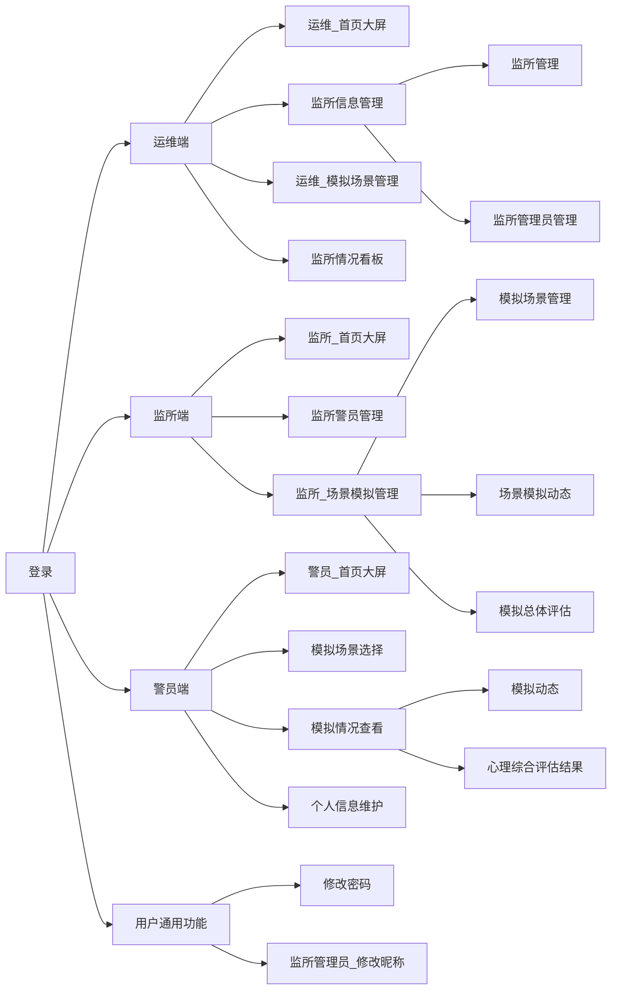

<div align="center">
    <h1>
        监所警员心理保障与管理系统_软件结构设计说明_V1.0
    </h1>
    <h3>
        编写人员:王旻安,党艳,吴思赣    编写时间:2023.4.1
    </h3>
</div>


**文档评审记录**


  | 日期 | 文档版本 | 评审说明 | 评审人 |
  | ---- | -------- | -------- | ------ |
  |      |          |          |        |
  |      |          |          |        |
  |      |          |          |        |


## 1. 监所警员心理保障与管理系统体系结构设计

### 1.1 模块划分

总体上看，监所警员心理保障与管理系统分为四个模块。包括登录、运维端、监所端以及警员端。分别实现不同层级的功能。


### 1.2 模块层次结构关系




### 1.3 主要业务执行流程

#### 1.3.1 登录


#### 1.3.2 场景模拟

```mermaid
flowchart TD
    begin([开始]) --> 运维在模拟场景管理中新增场景并启用
    运维在模拟场景管理中新增场景并启用 --> 监所在已有模拟场景管理中开启场景
    监所在已有模拟场景管理中开启场景 --> 警员在模拟场景选择中选择场景
    警员在模拟场景选择中选择场景 --> 警员点击开始模拟
    警员点击开始模拟 --> 警员进行模拟
    警员进行模拟 --> 点击暂停训练
    点击暂停训练 --> 点击继续训练
    点击继续训练 --> 警员进行模拟
    警员进行模拟 --> 点击取消训练
    警员进行模拟 --> 点击结束训练
    点击取消训练 --> delete([训练结束,情况不计入数据库])
    点击结束训练 --> 训练结束,情况计入数据库
    训练结束,情况计入数据库 --> end([生成评估结果])
```

